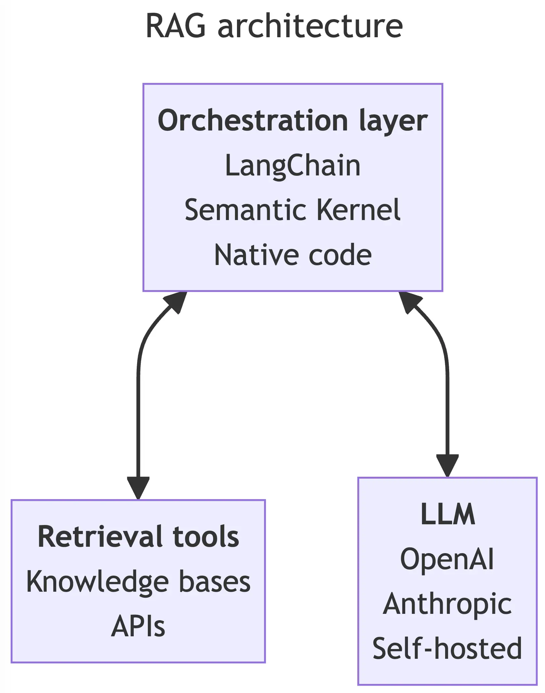
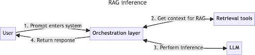
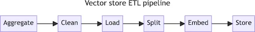

# RAG 综述: Keeping LLMs relevant and current

Generative AI technologies are powerful, but they're limited by what they know. While an LLM like ChatGPT can perform many tasks, every LLM's baseline knowledge has gaps based on its training data. If you ask an LLM to write something about a recent trend or event, the LLM won't have any idea what you're talking about, and the responses will be mixed at best and problematic at worst.

生成式人工智能技术非常强大，但受其所知的限制。虽然像ChatGPT这样的LLM可以执行许多任务，但每个LLM的基线知识都存在根据其训练数据的不足之处。如果您让LLM写一些关于最近的趋势或事件的东西，LLM将不会理解您在说什么，回复最好的时候是混杂的，最糟糕的情况下可能会出现问题。

LLMs' knowledge-based problems come down to two key issues:

LLM的知识问题归结为两个关键问题：

*   LLM training data tends to be hopelessly out-of-date (as of writing, ChatGPT's knowledge of the world ends at January 2022, excluding functionality like Browse with Bing and GPT-4V that provide additional context).

    LLM训练数据往往已经过时（截至撰写时，ChatGPT对世界的了解仅限于2022年1月，不包括提供额外背景信息的功能，如浏览Bing和GPT-4V）
*   LLMs extrapolate when facts aren’t available, so they confidently make false but plausible-sounding statements when there's a gap in their knowledge (called hallucination).

    当事实不可得时，LLM会进行推断，因此在其知识空白时，它们会自信地做出虽然听起来合理但却是错误的陈述（称为幻觉）。

Retrieval augmented generation (RAG) is a strategy that helps address both of these issues, pairing information retrieval with a set of carefully designed system prompts to anchor LLMs on precise, up-to-date, and pertinent information retrieved from an external knowledge store. Prompting LLMs with this contextual knowledge makes it possible to create domain-specific applications that require a deep and evolving understanding of facts, despite LLM training data remaining static.

检索增强生成（RAG）是一种策略，有助于解决这两个问题，它将信息检索与一组精心设计的系统提示配对，以锚定LLMs在从外部知识存储中检索的精确、最新和相关信息。通过使用这些上下文知识提示LLMs，可以创建需要对事实进行深入和不断发展的理解的特定领域应用，尽管LLM训练数据保持静态不变。

You could ask an LLM, "What is RAG?", and you might get very different responses depending on whether or not the LLM itself uses RAG:

您可以问一个LLM，“RAG是什么？”，根据LLM本身是否使用RAG，您可能会得到完全不同的回答：

**“What is RAG?” response with RAG**

> RAG, or retrieval augmented generation, is a method introduced by Meta AI researchers that combines an information retrieval component with a text generator model to address knowledge-intensive tasks. Its internal knowledge can be modified efficiently without needing to retrain the entire model. Would you like more details on this?
>
> RAG，或检索增强生成，是由Meta AI研究人员引入的一种方法，它结合了信息检索组件和文本生成模型，以解决知识密集型任务。它的内部知识可以有效修改，而不需要重新训练整个模型。您想了解更多详情吗？

**“What is RAG?” response without RAG**

> RAG can refer to several different things depending on the context. Here are a few common meanings:
>
> 红，黄，绿（RAG）：在项目管理和报告中，RAG是一种用于快速传达项目或任务状态或健康状况的颜色编码系统。

> 1\. Red, Amber, Green (RAG): In project management and reporting, RAG is a color-coding system used to quickly convey the status or health of a project or task.
>
> RAG分析：这是一种用于风险评估或决策的方法。它涉及根据其严重程度、影响或可取性将风险或选项分类为红色、黄色或绿色。它有助于优先考虑行动或选择。

> 2\. RAG Analysis: This is a method used in risk assessment or decision-making. It involves categorizing risks or options as Red, Amber, or Green based on their level of severity, impact, or desirability. It helps prioritize actions or choices.
>
> 随机访问生成器（RAG）：在一些技术上下文中，RAG可能指的是生成随机访问模式或数据的系统或算法，通常用于计算机科学或信息检索。

> 3\. Random Access Generator (RAG): In some technical contexts, RAG might refer to a system or algorithm that generates random access patterns or data, often used in computer science or information retrieval.
>
> 随机访问生成器（RAG）：在一些技术上下文中，RAG可能指的是生成随机访问模式或数据的系统或算法，通常用于计算机科学或信息检索

> 4\. Resource Allocation Graph (RAG): In the context of operating systems and computer science, a Resource Allocation Graph is used for deadlock detection. It's a directed graph that represents resource allocation and request relationships among processes in a system.
>
> 资源分配图（RAG）：在操作系统和计算机科学的背景下，资源分配图用于死锁检测。它是一个表示系统中进程之间的资源分配和请求关系的有向图。 如果您有特定的上下文或领域，请提供更多细节，我可以为您提供更精确的“RAG”解释。 在使用和不使用RAG的情况下回答这个问题有很大的不同。特别是在涉及特定领域知识（如首字母缩略词）的情况下，RAG可以极大地提高LLM响应的准确性。

> If you have a specific context or domain in mind, please provide more details, and I can give you a more precise explanation of "RAG" in that context.

There's a big difference between answering this question with and without RAG. Especially in cases involving domain-specific knowledge (like acronyms), RAG can drastically improve the accuracy of an LLM's responses.

回答这个问题是否使用了RAG存在很大的区别。特别是在涉及领域特定知识（如首字母缩略词）的情况下，RAG可以极大地提高LLM响应的准确性。

If you've interacted with a chatbot that knows about recent events, is aware of user-specific information, or has a deeper understanding of a subject than is normal, you've likely interacted with RAG without realizing it. If you've seen tutorials about "chatting over your documents," that's the simplest version of RAG around. Frameworks like LangChain and LlamaIndex have democratized RAG by making it possible to create simple knowledge-aware applications quickly.

如果您曾与一个了解最近事件、知晓用户特定信息或对某个主题有比正常情况下更深入理解的聊天机器人进行互动，那么您很可能已经与RAG进行了互动，而您可能并没有意识到。如果您看过关于“在您的文档上聊天”的教程，那就是RAG的最简单版本。像LangChain和LlamaIndex这样的框架通过快速创建简单的知识感知应用程序，使RAG民主化。

I've developed and implemented LLM applications internal to Skyflow, including systems that use RAG. With RAG being used nearly everywhere—and not leaving anytime soon—it's important to understand both the basics of RAG and how to move beyond those basics when you want to move your code into production. I invite you to learn from my experience on this RAG journey so you don't have to learn the hard way.

我在Skyflow内部开发和实现了LLM应用程序，包括使用RAG的系统。随着RAG几乎被普遍使用，并且不会很快离开，了解RAG的基础知识以及在将代码投入生产时如何超越这些基础知识是很重要的。我邀请您从我的RAG之旅经验中学习，这样您就不必走弯路。

## An overly simplified example <a href="#h2-37cbbb09e33f0" id="h2-37cbbb09e33f0"></a>

LangChain has an [example](https://python.langchain.com/docs/use\_cases/question\_answering/#quickstart) of RAG in its smallest (but not simplest) form:

```python
from langchain.document_loaders import WebBaseLoader
from langchain.indexes import VectorstoreIndexCreator
loader = WebBaseLoader("https://www.promptingguide.ai/techniques/rag")
index = VectorstoreIndexCreator().from_loaders([loader])
index.query("What is RAG?")
```

With these five lines, we get a description of RAG, but the code is heavily abstracted, so it's difficult to understand what's actually happening: We fetch the contents of a web page (our knowledge base for this example).

通过这五行，我们得到了有关RAG的描述，但是代码被大量抽象化，因此很难理解实际发生了什么：我们获取了一个网页的内容（本例中是我们的知识库）。

1. We process the source contents and store them in a knowledge base (in this case, a vector database). 我们处理源内容并将其存储在知识库中（在这种情况下，是矢量数据库）。
2. We input a prompt, LangChain finds bits of information from the knowledge base, and passes both prompt and knowledge base results to the LLM. 我们输入一个提示，LangChain从知识库中找到信息片段，并将提示和知识库结果传递给LLM。

While this script is helpful for prototyping and understanding the main beats of using RAG, it's not all that useful for moving beyond that stage because you don't have much control. Let's discuss what _actually_ goes into implementation.

虽然这个脚本对于原型设计和理解RAG的主要要点很有帮助，但对于超越这个阶段并不那么有用，因为您没有太多的控制。让我们讨论实际的实现过程。

## Basic architecture <a href="#h2-b309b1c3504b0" id="h2-b309b1c3504b0"></a>

Because a [full LLM application architecture](https://a16z.com/emerging-architectures-for-llm-applications/) would be fairly large, we're going to consider just the components that enable RAG:

由于完整的LLM应用程序架构可能相当庞大，我们将只考虑使RAG生效的组件：

* The **orchestration layer** receives the user's input in any associated metadata (like conversation history), interacts with all of the related tooling, ships the prompt off to the LLM, and returns the result. Orchestration layers are typically composed of tools like LangChain, Semantic Kernel, and others with some native code (often Python) knitting it all together.
* **编排层**接收用户的输入以及任何相关的元数据（如对话历史），与所有相关的工具进行交互，将提示发送给LLM，并返回结果。编排层通常由诸如LangChain、Semantic Kernel等工具组成，并通过一些原生代码（通常是Python）将它们串联起来。
* **Retrieval tools** are a group of utilities that return context that informs and grounds responses to the user prompt. This group encompasses both knowledge bases and API-based retrieval systems.
* **检索工具**是一组实用工具，用于返回上下文，为用户提示提供信息支持。这个组合涵盖了知识库和基于API的检索系统。
* **LLM** is the large language model that you're sending prompts to. They might be hosted by a third party like OpenAI or run internally in your own infrastructure. For the purposes of this article, the exact model you're using doesn't matter.
* **LLM**是您发送提示的大型语言模型。它们可能由第三方（如OpenAI）托管，也可能在您自己的基础设施中运行。就本文而言，您使用的确切模型并不重要。

<figure><figcaption></figcaption></figure>

In a typical LLM application, your inference processing script connects to retrieval tools as necessary. If you're building an LLM [agent](https://python.langchain.com/docs/modules/agents.html)-based application, each retrieval utility is exposed to your agent as a tool. From here on, we'll only discuss typical script-based usage.

在典型的LLM应用程序中，您的推理处理脚本根据需要连接到检索工具。如果您正在构建基于代理的LLM应用程序，每个检索工具都会作为一个工具暴露给您的代理。从现在开始，我们只会讨论典型的基于脚本的用法。

When users trigger your inference flow, the orchestration layer knits together the necessary tools and LLMs to gather context from your retrieval tools and generate contextually relevant, informed responses. The orchestration layer handles all your API calls and RAG-specific prompting strategies (which we'll touch on shortly). It also performs validations, like making sure you don't go over your LLM's token limit, which could cause the LLM to reject your request because you stuffed too much text into your prompt.

当用户触发您的推理流程时，编排层将所有必要的工具和LLMs组合在一起，从检索工具获取上下文，并生成与上下文相关、信息丰富的响应。编排层处理所有的API调用和RAG特定的提示策略（稍后我们会触及）。它还执行验证，例如确保您不会超出LLM的令牌限制，否则LLM可能会拒绝您的请求，因为您将太多文本放入了提示中。

<figure><figcaption></figcaption></figure>

## Knowledge base retrieval

To query your data, you not only need your data, you need it in a format that's accessible to your application. For LLM-based applications, this usually involves a vector store—a database that can query based on textual similarity rather than exact matches.

要查询您的数据，不仅需要您的数据，还需要将其以应用程序可访问的格式进行转换。对于基于LLM的应用程序，这通常涉及使用矢量存储器——一个可以根据文本相似性而不是精确匹配进行查询的数据库。

Getting your data from its source format into a vector store requires an ETL (extract, transform, load) pipeline.

将数据从其源格式转换为矢量存储器需要一个ETL（提取、转换、加载）管道。

<figure><figcaption></figcaption></figure>

1.  **Aggregate source documents.** Anything you want available to your application, you need to collect. For my work on Skyflow’s private LLM, this included our product documentation, white papers, and blog posts, but this could easily extend to internal records, planning documents, etc.

    **聚合源文档。**您想要应用程序可用的任何内容，都需要收集。对于我在Skyflow私有LLM的工作，这包括我们的产品文档、白皮书和博客文章，但这可能很容易扩展到内部记录、规划文档等。
2.  **Clean the document content.** If there's anything that shouldn't be visible to the LLM provider or to the end users of your application, now's your opportunity to remove it. At this stage in the process, remove personally identifiable information (PII), confidential information, and in-development content. Anything that remains after this step will be visible to all stages of the training and inference processes that follow. [Skyflow GPT Privacy Vault](https://www.skyflow.com/product/llm-privacy-vault) can help you de-identify document contents to keep your training data clear of sensitive information.

    **清理文档内容。**如果有任何不应该对LLM提供商或应用程序最终用户可见的内容，现在是移除它的时候了。在这个过程的阶段，移除个人身份信息（PII）、机密信息和正在开发中的内容。在这一步之后，任何内容都将对随后的训练和推理过程中的所有阶段可见。Skyflow GPT隐私保险库可以帮助您消除文档内容中的身份信息，以保持您的训练数据清晰
3.  **Load document contents into memory.** Tools like [Unstructured](https://unstructured.io/), [LlamaIndex](https://www.llamaindex.ai/), and LangChain's [Document loaders](https://python.langchain.com/docs/integrations/document\_loaders/) make it possible to load all sorts of document types into your applications, particularly unstructured content. Whether it's a text document, a spreadsheet, a web page, a PDF, a Git repo, or hundreds of other things, there's likely a loader for it. Be careful, though, because not all loaders are created equal, and some load more content or context than others. For example, one loader might load content from multiple sheets in a spreadsheet, while another loads content from only the first sheet.

    **将文档内容加载到内存中。**工具如Unstructured、LlamaIndex和LangChain的文档加载程序使得加载各种文档类型到您的应用程序成为可能，尤其是非结构化内容。无论是文本文档、电子表格、网页、PDF、Git仓库还是其他数百种内容，都可能有相应的加载程序。但要小心，因为并非所有的加载程序都是平等的，有些加载程序加载更多的内容或上下文，而其他一些加载程序则只加载第一个工作表中的内容。
4.  **Split the content into chunks.** When you _split_ your content, you break it into small, bite-sized pieces that can fit into an LLM prompt while maintaining meaning. There are multiple ways to split your content. Both LangChain and LlamaIndex have text splitters available, with defaults that split recursively by whitespace characters and by sentence, but you need to use whatever works best for you and your content. For my project, I found that my documentation, written in Markdown, lost too much context even with LangChain's Markdown splitter, so I wrote my own splitter that chunked content based on Markdown's heading and code block markup.

    **将内容拆分成块。**当您拆分内容时，您将其分成小的、字节大小的部分，可以适应LLM提示而保持意义。有多种方法可以拆分您的内容。LangChain和LlamaIndex都提供了文本分割器，其默认情况是通过空格字符和句子递归地拆分，但您需要使用最适合您和您的内容的方法。对于我的项目，我发现我的Markdown文档即使使用LangChain的Markdown分割器，也丢失了太多的上下文，因此我编写了自己的分割器，根据Markdown的标题和代码块标记对内容进行了分块。
5.  **Create embeddings for text chunks.** Embeddings store vectors—numerical representations of one text chunk's relative position and relationship to other nearby text chunks. While that's difficult to visualize, creating embeddings is thankfully easy. OpenAI offers an embeddings model, LangChain and LlamaIndex offer a variety of hosted or self-hosted embedding options, or you can do it yourself with an embedding model like [SentenceTransformers](https://www.sbert.net/).

    **为文本块创建嵌入。**嵌入存储向量——相对位置和与其他附近文本块关系的数值表示。尽管这很难可视化，但创建嵌入实际上是很容易的。OpenAI提供了嵌入模型，LangChain和LlamaIndex提供了各种托管或自托管的嵌入选项，或者您可以使用类似SentenceTransformers的嵌入模型自行创建嵌入。
6.  **Store embeddings in a vector store.** Once you have your embeddings, you can add them to a [vector store](https://stackoverflow.blog/2023/10/09/from-prototype-to-production-vector-databases-in-generative-ai-applications/) such as Pinecone, Weaviate, FAISS, Chroma or a multitude of other options.

    **将嵌入存储在向量数据库器中。**一旦您拥有了嵌入，您就可以将它们添加到向量数据库中，如Pinecone、Weaviate、FAISS、Chroma或其他选项。

Once the vectors are stored, you can query the vector store and find the content that's most similar to your query. If you need to update or add to your source documents, most vector stores allow updating the store. This means you can also _remove_ content from your vector store, something you can't do when you fine-tune a model.

一旦向量被存储，您就可以查询并找到与您的查询最相似的内容。如果需要更新或添加源文档，大多数向量数据库允许更新存储。这意味着您也可以从向量数据库中删除内容，在微调模型时无法做到这一点。

You can run the pipeline again to recreate the whole knowledge base, and while that would be less expensive than re-training a model, it would still prove time-consuming and inefficient. If you expect to update your source documents regularly, consider creating a document indexing process so you only process the new and recently updated documents in your pipeline.

您可以再次运行管道来重新创建整个知识库，虽然这比重新训练模型要便宜，但仍然耗时且效率低下。如果您希望定期更新源文档，请考虑创建一个文档索引过程，这样您只需处理管道中的新文档和最近更新的文档。

## API-based retrieval <a href="#h2-f1c1dd4f78500" id="h2-f1c1dd4f78500"></a>

Retrieval from a vector store isn't the only kind of retrieval. If you have any data sources that allow programmatic access (customer records databases, an internal ticketing system, etc.), consider making them accessible to your orchestration layer. At run time, your orchestration layer can query your API-based retrieval systems to provide additional context pertinent to your current request.

从向量数据库中检索不是唯一的检索方式。如果您有任何允许程序访问的数据源（如客户记录数据库、内部工单系统等），请考虑使它们对编排层可访问。在运行时，编排层可以查询基于API的检索系统，以提供与当前请求相关的附加上下文。

## Prompting with RAG

After your retrieval tools are set up, it's time for a bit of orchestration-layer magic to knit it all together.

在设置好检索工具之后，现在是进行一些编排层魔术操作，将它们全部串联在一起的时候了。

First, we'll start with the prompt template. A prompt template includes placeholders for all the information you want to pass to the LLM as part of the prompt. The system (or base) prompt tells the LLM how to behave and how to process the user's request. A simple prompt template might look like this:

首先，我们将从提示模板开始。提示模板包括用于作为提示的一部分传递给LLM的所有信息的占位符。系统（或基本）提示告诉LLM如何行动以及如何处理用户的请求。一个简单的提示模板可能如下所示：

```yaml
System: You are a friendly chatbot assistant that responds in a conversational
manner to users' questions. Respond in 1-2 complete sentences, unless specifically
asked by the user to elaborate on something. Use History and Context to inform your answers.
您是一个友好的聊天机器人助手，以对话方式回答用户的问题。除非用户明确要求对某些内容进行详细说明，
否则请用1-2个完整句子回答。使用历史和上下文来指导您的回答。
---
History: {history}
---
Context: {context}
---
User: {request}
```

When your end user submits a request, you get to start filling in the variables. If the user submitted "What is RAG?", you could fill in the _request_ variable. You'd likely get the conversation history along with the request, so you could fill in that variable, too:

当您的最终用户提交请求时，您可以开始填写变量。如果用户提交了“什么是RAG？”的请求，您可以填写请求变量。您可能会得到对话历史以及请求，因此您可以填写该变量：

```yaml
System: You are a friendly chatbot assistant that responds in a conversational
manner to user's questions. Respond in short but complete answers unless specifically
asked by the user to elaborate on something. Use History and Context to inform your answers.
---
History: [{"role": "assistant", "message": "Hi! How can I help you?"}]
---
Context: {context}
---
User: What is RAG?
```

Next, call your retrieval tools, whether they're vector stores or other APIs. Once you have your context (knowledge base results, customer records, etc.), you can update the _context_ variable to inform and ground the LLM during inference.

接下来，调用您的检索工具，无论它们是向量数据库还是其他API。一旦获得上下文（知识库结果、客户记录等），您就可以更新上下文变量，以在推理过程中为LLM提供信息支持和基础。

**Note:** If you have multiple kinds of data included in your RAG implementation, make sure to label them to help the LLM differentiate between them.

**注意：**如果您的RAG实现中包含多种类型的数据，请确保对其进行标记，以帮助LLM区分它们。

```yaml
System: You are a friendly chatbot assistant that responds in a conversational
manner to user's questions. Respond in short but complete answers unless specifically
asked by the user to elaborate on something. Use History and Context to inform your answers.
---
History: [{"role": "assistant", "message": "Hi! How can I help you?"}]
---
Context: [Document(page_content='Meta AI researchers introduced a method called [Retrieval Augmented Generation](https://ai.facebook.com/blog/retrieval-augmented-generation-streamlining-the-creation-of-intelligent-natural-language-processing-models/) (RAG) to address such knowledge-intensive tasks. RAG combines an information retrieval component with a text generator model. RAG can be fine-tuned and its internal knowledge can be modified in an efficient manner and without needing retraining of the entire model.', metadata={'source': 'https://www.promptingguide.ai/techniques/rag', 'title': 'Retrieval Augmented Generation (RAG)'})]
---
User: What is RAG?
```

With your context in place, your prompt template is filled out, but you still have two post-processing tasks to complete:

有了上下文后，您的提示模板就填写完成了，但您仍然需要完成两个后处理任务：

* Much like you cleaned your source data, you need to clean your prompt as well. Users can input PII in their request even when your data is clean, and you don't want your users' information ending up in an LLM operator's logs or data stores. This also serves as a safeguard in case you _didn't_ clean your source data. In addition to de-identifying data sets and prompts, [Skyflow GPT Privacy Vault](https://www.skyflow.com/product/llm-privacy-vault) can also re-identify sensitive values in LLM responses before you send responses to users.
* 就像您清理了源数据一样，您还需要清理提示。即使在数据清理干净的情况下，用户仍然可能在其请求中输入PII，您不希望用户的信息最终出现在LLM操作员的日志或数据存储中。这也是一种保护措施，以防您没有清理源数据。除了去识别数据集和提示之外，Skyflow GPT隐私保险库还可以在将响应发送给用户之前重新识别LLM响应中的敏感值。
* Make sure you don't exceed your LLM's token limits. If you do, your inference attempts will fail. Before you attempt inference, use token calculators (like [tiktoken](https://github.com/openai/tiktoken)), to make sure you're within LLM-specific limits. You may have to reduce the amount of context you include to fit within your token limit.
* 确保不要超出LLM的令牌限制。如果超出了，您的推理尝试将失败。在尝试推理之前，请使用令牌计算器（如tiktoken）确保您在LLM特定的限制范围内。您可能需要减少包含的上下文量，以适应您的令牌限制。

Once your prompt is cleaned and within token limits, you can finally perform inference by sending the prompt to your LLM of choice. When you get the response, it should be informed by the context you provided, and you can send it back to the user.

一旦您的提示被清理并且在令牌限制内，您就可以将其发送给您选择的LLM进行推理。当您获得响应时，它应该受到您提供的上下文的影响，您可以将其发送回用户。

## Improving performance <a href="#h2-a7251f6ff34d0" id="h2-a7251f6ff34d0"></a>

Now that you have RAG working in your application, you may want to move to production immediately. Don't do it yet! Alternatively, you may not be all that thrilled with the results you have. Never fear, here are a handful of things you can do to improve your RAG performance and get production-ready:

既然您的应用程序中已经使用了RAG，您可能想立即将其投入生产。但现在还不要这样做！或者，您可能对现有结果不太满意。别担心，以下是一些可用于改进RAG性能并准备投入生产的方法：

* **Garbage in, garbage out.** The higher the quality of the context you provide, the higher quality result you'll receive. Clean up your source data to make sure your data pipeline is maintaining adequate content (like capturing spreadsheet column headers), and make sure unnecessary markup is removed so it doesn't interfere with the LLM's understanding of the text.
* **垃圾进，垃圾出。**您提供的上下文质量越高，您收到的结果质量就越高。清理您的源数据，确保您的数据管道维护足够的内容（例如捕获电子表格列标题），并确保删除不必要的标记，以免干扰LLM对文本的理解。
* **Tune your splitting strategy**. Experiment with different text chunk sizes to make sure your RAG-enabled inference maintains adequate context. Each data set is different. Create differently split vector stores and see which one performs best with your architecture.
* **调整拆分策略。**尝试不同的文本块大小，以确保启用RAG的推理保持足够的上下文。每个数据集都是不同的。创建不同拆分的向量存储器，看看哪个与您的架构表现最好。
* **Tune your system prompt.** If the LLM isn't paying enough attention to your context, update your system prompt with expectations of how to process and use the provided information.
* **调整系统提示**。如果LLM没有足够注意您提供的上下文，请更新系统提示，以指示如何处理和使用所提供的信息。
* **Filter your vector store results.** If there are particular kinds of content you do or don't want to return, filter your vector store results against metadata element values. For example, if you want a process, you might filter against a docType metadata value to make sure your results are from a how-to document.
* **过滤向量数据库的结果。**如果有特定类型的内容您想要或不想要返回，请根据元数据元素值对矢量存储器的结果进行过滤。例如，如果您想要一个流程，您可以根据文档类型元数据值对结果进行过滤，以确保结果来自操作文档。
* **Try different embedding models (and fine-tune your own).** Different embedding models have different ways of encoding and comparing vectors of your data. Experiment to see which one performs best for your application. You can check out the current best-performing open source embedding models at the [MTEB leaderboard](https://huggingface.co/spaces/mteb/leaderboard). If you're adventurous, you can also fine-tune your own embedding models so your LLM becomes more aware of domain-specific terminology, and therefore gives you better query results. And yes, you can absolutely use your cleaned and processed knowledge base dataset to fine-tune your model.
* **尝试不同的嵌入模型（并微调您自己的模型）。**不同的嵌入模型有不同的方法来编码和比较您的数据的向量。尝试看看哪个对您的应用程序表现最佳。您可以在MTEB排行榜上查看当前表现最佳的开源嵌入模型。如果您愿意尝试，您还可以微调自己的嵌入模型，使您的LLM更加了解特定领域的术语，从而为您提供更好的查询结果。是的，您绝对可以使用清理和处理过的知识库数据集来微调您的模型。

## What about fine-tuning? <a href="#h2-f595779e7c040" id="h2-f595779e7c040"></a>

Before we wrap up, let's address another LLM-related buzzword: fine-tuning.

在我们结束之前，让我们解决另一个与LLM相关的热词：微调。

Fine-tuning and RAG provide two different ways to optimize LLMs. While RAG and fine-tuning both leverage source data, they each have unique advantages and challenges to consider.

微调和RAG提供了两种不同的优化LLM的方式。虽然RAG和微调都利用源数据，但它们各自具有独特的优势和挑战需要考虑。

Fine-tuning is a process that continues training a model on additional data to make it perform better on the specific tasks and domains that the data set details. However, a single model can't be the best at everything, and tasks unrelated to the fine-tuned tasks often degrade in performance with additional training. For example, fine-tuning is how code-specific LLMs are created. Google's Codey is fine-tuned on a curated dataset of code examples in a variety of languages. This makes Codey perform substantially better at coding tasks than Google's Duet or PaLM 2 models, but at the expense of general chat performance.

微调是一个持续训练模型的过程，使用额外的数据使其在特定任务和领域上表现更好。然而，单个模型不可能在所有方面都表现最佳，并且与微调任务无关的任务通常在额外训练后性能下降。例如，微调是创建特定于代码的LLM的方式。Google的Codey就是在一系列语言中的代码示例的精选数据集上进行微调的。这使得Codey在编码任务上的表现比Google的Duet或PaLM 2模型好得多，但以一般聊天性能为代价。

Conversely, RAG augments LLMs with relevant and current information retrieved from external knowledge bases. This dynamic augmentation lets LLMs overcome the limitations of static knowledge and generate responses that are more informed, accurate, and contextually relevant. However, the integration of external knowledge introduces increased computational complexity, latency, and prompt complexity, potentially leading to longer inference times, higher resource utilization, and longer development cycles.

相反，RAG通过将来自外部知识库的相关和当前信息与LLM结合起来。这种动态增强使LLM能够克服静态知识的限制，并生成更为知情、准确和与上下文相关的响应。然而，集成外部知识引入了增加的计算复杂性、延迟和提示复杂性，可能导致推理时间更长、资源利用率更高和开发周期更长。

RAG does best fine-tuning in one specific area: forgetting. When you fine-tune a model, the training data becomes a part of the model itself. You can't isolate or remove a specific part of the model. LLMs can't forget. However, vector stores let you add, update, and delete their contents, so you can easily remove erroneous or out-of-date information whenever you want.

在一个特定领域，RAG最擅长的微调是“遗忘”。当您微调一个模型时，训练数据成为模型本身的一部分。您无法隔离或删除模型的特定部分。LLM无法忘记。然而，向量数据库允许您添加、更新和删除其内容，因此您可以随时删除错误或过时的信息。

Fine-tuning and RAG together can create LLM-powered applications that are specialized to specific tasks or domains and are capable of using contextual knowledge. Consider GitHub Copilot: It's a fine-tuned model that specializes in coding and uses your code and coding environment as a knowledge base to provide context to your prompts. As a result, Copilot tends to be adaptable, accurate, and relevant to your code. On the flip side, Copilot's chat-based responses can anecdotally take longer to process than other models, and Copilot can't assist with tasks that aren't coding-related.

微调和RAG共同可以创建专门针对特定任务或领域的LLM应用程序，并能够使用上下文知识。考虑GitHub Copilot：它是一个经过微调的模型，专门用于编码，并使用您的代码和编码环境作为知识库，以为您的提示提供上下文。结果，Copilot往往是适应性、准确性和与您的代码相关性很高的。另一方面，据说Copilot的基于聊天的响应处理时间可能比其他模型更长，Copilot不能处理与编码无关的任务。

## Wrap-up <a href="#h2-12f3e740d4520" id="h2-12f3e740d4520"></a>

RAG represents a practical solution to enhance the capabilities of LLMs. By integrating real-time, external knowledge into LLM responses, RAG addresses the challenge of static training data, making sure that the information provided remains current and contextually relevant.

RAG代表了增强LLM功能的一种实用解决方案。通过将实时的外部知识集成到LLM响应中，RAG解决了静态训练数据的挑战，确保提供的信息保持当前且与上下文相关。

Going forward, integrating RAG into various applications holds the potential to significantly improve user experiences and information accuracy. In a world where staying up-to-date is crucial, RAG offers a reliable means to keep LLMs informed and effective. Embracing RAG's utility enables us to navigate the complexities of modern AI applications with confidence and precision.

未来，将RAG集成到各种应用程序中有望显着改善用户体验和信息准确性。在一个需要保持最新的世界中，RAG提供了一种可靠的方法来让LLM保持知情且有效。拥抱RAG的效用使我们能够自信而准确地应对现代AI应用程序的复杂性。

\


\
\


### &#x20;

\
