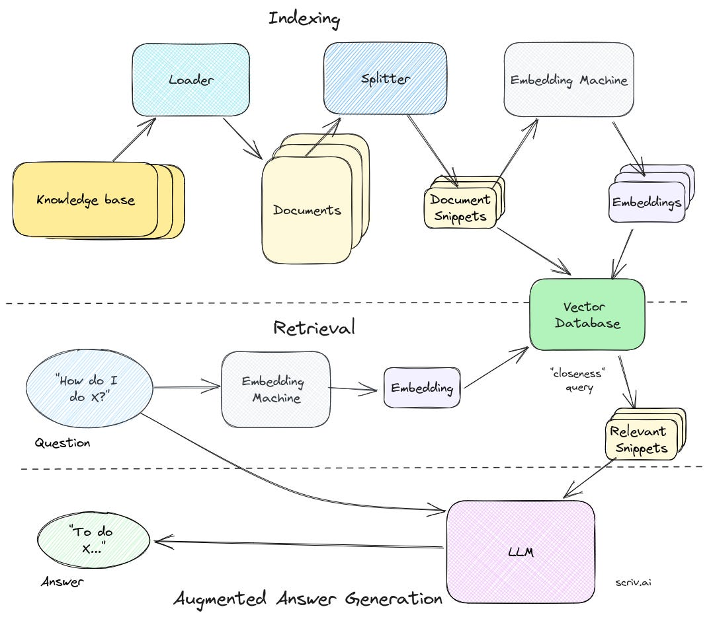
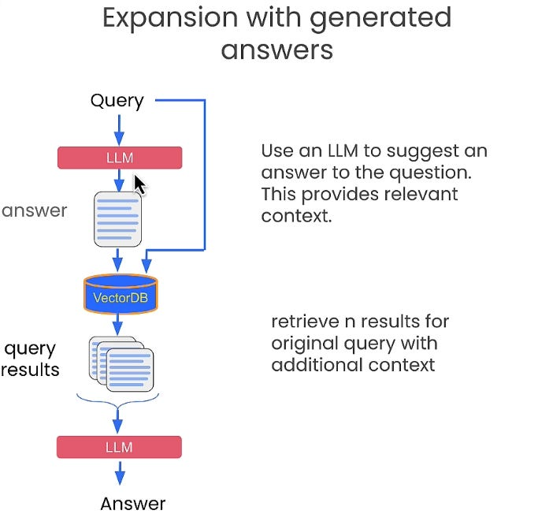
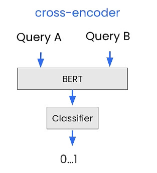
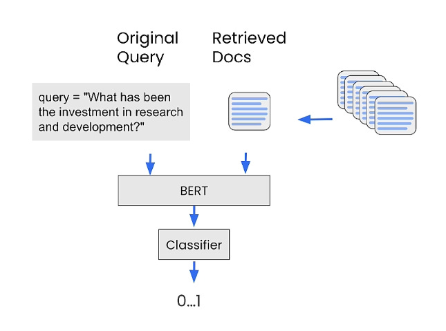
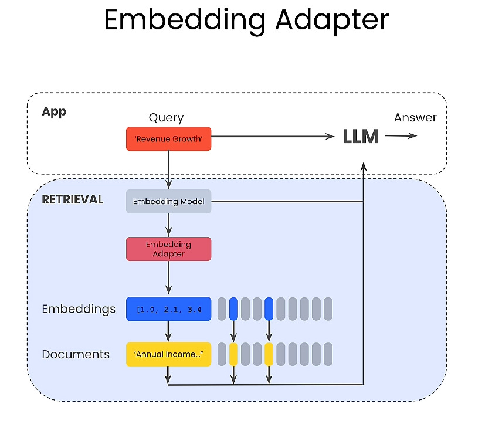

# \[检索技术] RAG的高级检索技术

<mark style="color:green;">感谢您关注我们对检索增强生成（RAG）系统的概述。我们希望这份指南能够揭示RAG的复杂工作原理，并展示其在不同环境下革新信息检索和响应生成的潜力。</mark>

<mark style="color:green;">我们已经建立了将RAG系统应用于生产环境的丰富经验。我们的专业知识涵盖了评估组织需求、部署定制化的、高性能的RAG解决方案。</mark>

<mark style="color:green;">如果您正在考虑将RAG系统融入公司运营中，并需要专业指导以确保成功，我们愿意提供帮助。我们将协助您在这个充满活力的技术领域中导航，以全新的方式利用检索增强生成（RAG）解锁您组织的集体知识潜力。</mark>

<mark style="color:green;">可以添加我的微信（备注RAG），咨询构建高质量申请加入我们的LLM+RAG高可用技术群！</mark>

<figure><figcaption></figcaption></figure>

<figure><figcaption></figcaption></figure>

先贴上RAG的这张图，它揭示了索引（Index)和检索（Retrieval）过程，虽然略显复杂，但对整个过程的理解至关重要。本文介绍的内容均发生在Retrieval阶段。

## 1— Query expansion 查询扩展 <a href="#sr-toc-0" id="sr-toc-0"></a>

Query expansion refers to a set of techniques that rephrase the original query.

查询扩展指的是一组对原始查询进行改写的技术。

We’ll look at two methods:

### **👉 Query expansion with a generated answer**

借助生成的答案进行查询扩展

Given an input query, this method first instructs an LLM to provide a hypothetical answer, whatever its correctness.

给定一个输入查询，此方法首先指示一个大型语言模型提供一个假设性的答案，不论其正确与否。

Then, the query and the generated answer are combined in a prompt and sent to the retrieval system.

然后，将查询和生成的答案组合在一个提示中，发送给检索系统。

<figure><figcaption></figcaption></figure>

> This technique **surprisingly works well**. Check the findings of this [paper](https://arxiv.org/abs/2212.10496) to learn more about it. 同样来自国人的一篇论文

The rationale behind this method is that we want to retrieve documents that look more like an answer. The correctness of the hypothetical answer doesn’t matter much because what we’re really interested in is its structure and formulation.

这种方法背后的基本原理是，我们希望检索到更像答案的文档。假设性答案的正确性并不是很重要，因为我们真正感兴趣的是它的结构和表述方式。

At best, you could consider the hypothetical answer as a template that helps identify a relevant neighborhood in the embedding space.

在最佳情况下，你可以将假设性答案视为一个模板，它有助于在嵌入空间中识别出一个相关的邻域。

Here’s an example of a prompt I used to augment the query for a RAG that answers questions about financial reports.

这里有一个我用来增强 RAG 查询的示例，这个 RAG 用于回答有关财务报告的问题。

```
You are a helpful expert financial research assistant. 

Provide an example answer to the given question, that might be found in a document like an annual report.
```

### **👉 Query expansion with multiple related questions**

This second method instructs an LLM to generate N questions related to the original query and then sends them all (+ the original query) to the retrieval system.

这第二种方法指示一个大型语言模型生成 N 个与原始查询相关的问题，然后将它们全部（+原始查询）发送到检索系统。

By doing this, more documents will be retrieved from the vectorstore. However, some of them will be duplicates which is why you need to perform post-processing.

通过这样做，将从向量存储中检索到更多文档。然而，其中一些文档将是重复的，这就是为什么你需要执行后处理的原因。

\
The idea behind this method is that you extend the initial query that may be incomplete and incorporate related aspects that can be eventually relevant and complementary.

这种方法背后的思想是，你扩展了可能不完整的初始查询，并纳入相关方面，这些方面最终可能是相关且互补的。

Here’s a prompt I used to generate related questions:

```
You are a helpful expert financial research assistant. 
Your users are asking questions about an annual report.
Suggest up to five additional related questions to help them find the information they need, for the provided question.
Suggest only short questions without compound sentences. Suggest a variety of questions that cover different aspects of the topic.
Make sure they are complete questions, and that they are related to the original question.
Output one question per line. Do not number the questions."
```

The downside of this method is that we end up with a lot more documents that may distract the LLM from generating a useful answer.

这种方法的缺点是，我们最终会得到更多可能会分散大型语言模型生成有用答案注意力的文档。\


**hat’s where re-ranking comes into play.**

> To learn more about different query expansion techniques, check this [paper](https://arxiv.org/abs/2305.03653) for Google.

## 2—Cross encoder re-ranking 交叉编码器重排序

This method re-ranks the retrieved documents according to a score that quantifies their relevancy with the input query.

这种方法根据一个分数对检索到的文档进行重新排序，该分数量化了它们与输入查询的相关性。\
\


To compute this score, we will use a _cross-encoder._

为了计算这个分数，我们将使用一个交叉编码器。

A cross-encoder is a deep neural network that processes two input sequences together as a single input. This allows the model to directly compare and contrast the inputs, understanding their relationship in a more integrated and nuanced way.

交叉编码器是一种深度神经网络，它将两个输入序列一起作为单个输入进行处理。这使得模型能够直接比较和对比输入，以更加综合和细致的方式理解它们之间的关系。

<figure><figcaption></figcaption></figure>

Cross-encoders can be used for Information Retrieval: given a query, encode the query with all retrieved documents. Then, sort them in a decreasing order. The high-scored documents are the most relevant ones.

交叉编码器可用于信息检索：给定一个查询，将查询与所有检索到的文档一起编码。然后，将它们按降序排序。得分高的文档是最相关的文档。

> See [**SBERT.net Retrieve & Re-rank**](https://www.sbert.net/examples/applications/retrieve\_rerank/README.html) for more details.

<figure><figcaption></figcaption></figure>

Here’s how to quickly get started with re-ranking using cross-encoders:

* Install sentence-transformers:

```
pip install -U sentence-transformers
```

* Import the cross-encoder and load it:

```
from sentence_transformers import CrossEncoder
cross_encoder = CrossEncoder('cross-encoder/ms-marco-MiniLM-L-6-v2')
```

* Score each pair of (query, document):

```
pairs = [[query, doc] for doc in retrieved_documents]
scores = cross_encoder.predict(pairs)
print("Scores:")
for score in scores:
    print(score)

Scores:
0.98693466
2.644579
-0.26802942
-10.73159
-7.7066045
-5.6469955
-4.297035
-10.933233
-7.0384283
-7.3246956
```

* Reorder the documents:

```
print("New Ordering:")
for o in np.argsort(scores)[::-1]:
    print(o+1)
```

> Cross-encoder re-ranking can be used with query expansion: after you generate multiple related questions and retrieve the corresponding documents (say you end up with M documents), you re-rank them and pick the top K (K < M). That way, you reduce the context size while selecting the most important pieces.
>
> 交叉编码器重排序可以与查询扩展一起使用：在你生成多个相关问题并检索相应的文档之后（假设你最终得到了 M 份文档），你对它们进行重排序并选择排名前 K 的文档（K < M）。这样，你就减小了上下文大小，同时选择了最重要的部分。

In the next section, we’re going to dive into adaptors, a powerful yet simple-to-implement technique to scale embeddings to better align with the user’s task.

在下一节中，我们将深入探讨适配器，这是一种强大而简单的技术，用于扩展嵌入，以更好地与用户的任务对齐。

## 3—Embedding adaptors 嵌入适配器

This method leverages feedback on the relevancy of the retrieved documents to train an adapter.

这种方法利用对检索到的文档相关性的反馈来训练一个适配器。

> An adapter is a lightweight alternative to fully fine-tune a pre-trained model. Currently, adapters are implemented as **small feedforward neural networks that are inserted between layers of pre-trained models.**
>
> 适配器是对预训练模型进行全面微调的轻量级替代方案。目前，适配器被实现为**小型前馈神经网络，它们被插入到预训练模型的各层之间。**

The underlying goal of training an adapter is to alter the embedding query to produce better retrieval results for a specific task.

训练适配器的基本目标是改变嵌入查询，以便为特定任务产生更好的检索结果。

An embedding adapter is a stage that can be inserted after the embedding phase and before the retrieval. Think about it as a matrix.

嵌入适配器是一个可以在嵌入阶段之后和检索之前插入的阶段。可以将其视为一个矩阵。


<figure><figcaption></figcaption></figure>

To train an adapter, we need to go through the following steps:

### **Prepare the training data**

To train an embedding adapter, we need some training data on the relevancy of the documents. (it can be manually annotated or synthetic)

要训练嵌入适配器，我们需要一些关于文档相关性的训练数据（可以是手动标注的或合成的）。

This data must include tuples of (query, document) as well as their corresponding labels (1 if the document is relevant to the query, -1 otherwise).

这些数据必须包括（查询，文档）的元组及其对应的标签（如果文档与查询相关，则为 1；否则为 -1）。

For this tutorial, we’re going to create a synthetic dataset. To do that, we first generate sample questions using an LLM and this prompt:

在本教程中，我们将创建一个合成数据集。为此，我们首先使用一个大型语言模型和以下提示生成示例问题：

```
You are a helpful expert financial research assistant. 
You help users analyze financial statements to better understand companies.
Suggest 10 to 15 short questions that are important to ask when analyzing an annual report.
Do not output any compound questions (questions with multiple sentences or conjunctions).
Output each question on a separate line divided by a newline.
```

Then, we retrieve documents for each generated question

We evaluate the relevance of each question to the retrieved document using an LLM with the following prompt:

```
You are a helpful expert financial research assistant. 
You help users analyze financial statements to better understand companies.
For the given query, evaluate whether the following satement is relevant.
Output only 'yes' or 'no'.
```

Then, we create tuples and corresponding labels

```
adapter_query_embeddings = []
adapter_doc_embeddings = []
adapter_labels = []

for q, query in enumerate(tqdm(generated_queries)):
    for d, document in enumerate(retrieved_documents[q]):
        adapter_query_embeddings.append(query_embeddings[q])
        adapter_doc_embeddings.append(retrieved_embeddings[q][d])
        adapter_labels.append(evaluate_results(query, document))
```

and put everything in a Torch dataset:

```
adapter_query_embeddings = torch.Tensor(np.array(adapter_query_embeddings))
adapter_doc_embeddings = torch.Tensor(np.array(adapter_doc_embeddings))
adapter_labels = torch.Tensor(np.expand_dims(np.array(adapter_labels),1))
dataset = torch.utils.data.TensorDataset(adapter_query_embeddings, adapter_doc_embeddings, adapter_labels)
```

### **Define a model**

We define a function that takes the query embedding, the document embedding, and the adaptor matrix. Then, it multiplies the query embedding with embedding matrix and computes a cosine similarity between this result and the document embedding.\
我们定义一个函数，该函数接受查询嵌入、文档嵌入和适配器矩阵。然后，它将查询嵌入与嵌入矩阵相乘，并计算该结果与文档嵌入之间的余弦相似度。

```
def model(query_embedding, document_embedding, adaptor_matrix):
    updated_query_embedding = torch.matmul(adaptor_matrix, query_embedding)
    return torch.cosine_similarity(updated_query_embedding, document_embedding, dim=0)
```

### **Define the loss**

We use MSE as the error to optimize the model.

我们使用均方误差（MSE）作为优化模型的误差指标。

```
def mse_loss(query_embedding, document_embedding, adaptor_matrix, label):
    return torch.nn.MSELoss()(model(query_embedding, document_embedding, adaptor_matrix), label)
```

### **Run backpropagation:**

We run 100 epochs to train the adapter matrix.

我们运行100个周期来训练适配器矩阵。

```
# Initialize the adaptor matrix
mat_size = len(adapter_query_embeddings[0])
adapter_matrix = torch.randn(mat_size, mat_size, requires_grad=True)

min_loss = float('inf')
best_matrix = None

for epoch in tqdm(range(100)):
    for query_embedding, document_embedding, label in dataset:
        loss = mse_loss(query_embedding, document_embedding, adapter_matrix, label)

        if loss < min_loss:
            min_loss = loss
            best_matrix = adapter_matrix.clone().detach().numpy()

        loss.backward()
        with torch.no_grad():
            adapter_matrix -= 0.01 * adapter_matrix.grad
            adapter_matrix.grad.zero_()
```

When the training is complete, the adapter can now be used to scale the original embedding and adapt to the user task. All you need now is take the original embedding output and multiply it with the adaptor matrix before feeding it to the retrieval system.

当训练完成后，适配器现在可以用来扩展原始嵌入并适应用户任务。现在你需要做的就是取原始嵌入输出，并在将其送入检索系统之前，先用适配器矩阵进行乘法运算。\


## Appendix 补充

These retrieval techniques we coverd help improve the relevancy of the documents.

我们讨论的这些检索技术有助于提高文档的相关性。

There’s however an ongoing research in this area and other methods are currently being assessed. For example,

然而，这一领域的研究仍在进行中，其他方法也在评估中。例如：

* Fine-tuning the embedding model 微调嵌入模型
* Fine-tuning the LLM directly 直接微调大型语言模型
* Deep embedding adaptors 深度嵌入适配器
* Deep chunking 深度分块

***

在LlamaIndex中，有一些技术与查询扩展紧密相关，特别是通过其"Query Pipelines"和"Query Transformations"功能。

1. **Query Pipelines**：LlamaIndex引入了Query Pipelines，这是一种声明式API，允许用户简洁地构建从简单到高级的查询工作流。这包括了对用户查询的理解和转换（如重写、路由），可能还包括多阶段的检索算法（如top-k查找+重排序）。此外，它还允许使用提示和LLMs以不同方式进行响应合成。Query Pipelines提供了一个声明式的查询编排抽象，允许用户以更少的代码行数表达常见的查询工作流程，并提高代码的可读性。[LlamaIndex](https://www.llamaindex.ai/blog/introducing-query-pipelines-025dc2bb0537)
2. **Query Transformations**：LlamaIndex允许在索引结构上执行查询转换，这些转换模块会将一个查询转换为另一个查询。这可以是单步的，即在执行索引查询之前运行一次转换；也可以是多步的，即转换查询、对索引执行查询，然后可能再次转换结果。[LlamaIndex](https://docs.llamaindex.ai/en/stable/optimizing/advanced\_retrieval/query\_transformations/)

例如，在Query Pipelines中，可以通过两个提示（prompts）之后进行检索，其中一个提示用于应用查询重写，另一个生成假设答案以丰富检索（称为HyDE）。这可以建立为顺序链，因为每个提示只接受一个输入，QueryPipeline将自动将LLM输出链入提示，然后链入LLM（[Towards AI](https://towardsai.net/p/machine-learning/llamaindex-query-pipelines-quickstart-guide-to-the-declarative-query-api)）。

这些特性和技术在LlamaIndex中为开发者提供了灵活而强大的工具，以优化和增强查询处理能力，特别是在涉及查询扩展以提高检索效率和准确性方面。


<figure><figcaption></figcaption></figure>
