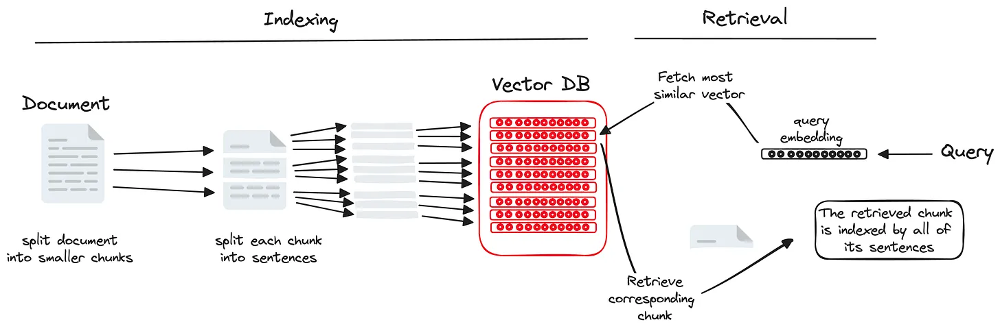
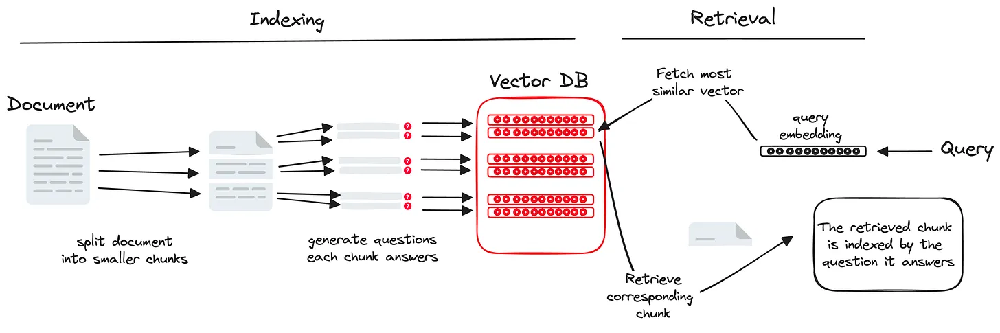
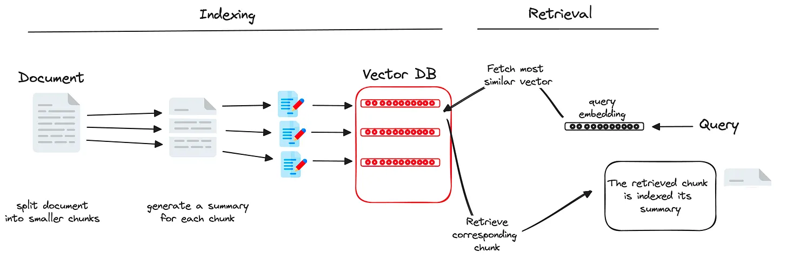

# \[索引相关] 通过这三种索引方法改善 RAG Pipeline

<mark style="color:green;">感谢您关注我们对检索增强生成（RAG）系统的概述。我们希望这份指南能够揭示RAG的复杂工作原理，并展示其在不同环境下革新信息检索和响应生成的潜力。</mark>

<mark style="color:green;">我们已经建立了将RAG系统应用于生产环境的丰富经验。我们的专业知识涵盖了评估组织需求、部署定制化的、高性能的RAG解决方案。</mark>

<mark style="color:green;">如果您正在考虑将RAG系统融入公司运营中，并需要专业指导以确保成功，我们愿意提供帮助。我们将协助您在这个充满活力的技术领域中导航，以全新的方式利用检索增强生成（RAG）解锁您组织的集体知识潜力。</mark>

<mark style="color:green;">可以添加我的微信（备注RAG），咨询构建高质量申请加入我们的LLM+RAG高可用技术群！</mark>

<figure><figcaption></figcaption></figure>

<figure><figcaption></figcaption></figure>

## Reminder on data indexing in typical RAGs

In the default implementation of a RAG system, documents are first split into chunks.

Then, each chunk is embedded and indexed into a vector database.

In the retrieval step, the input query is also embedded and the most similar chunks are extracted.

\
In this setup, the data (i.e. _the chunks_) we retrieve is the same as the data we index.

<figure><figcaption></figcaption></figure>

This is the most natural and intuitive implementation.

🚨 However, this doesn’t have to be always the case.

We can index the chunks differently to increase the performance of such systems

***

**the data we retrieve doesn’t have to be the same as the data we used while indexing.**

***

## 1—Index chunks by their subparts 🧩 **通过子部分索引块**&#x20;

Instead of indexing the whole chunk directly, we can split it again into smaller pieces (e.g. sentences) and index it with those multiple times.

我们可以不直接对整个内容块进行索引，而是将其再次分割成更小的片段（例如，句子），并多次使用这些片段进行索引。

<figure><figcaption></figcaption></figure>

> **Why is this useful?**

Imagine dealing with long and complex chunks that discuss multiple topics or conflicting information. Using them in a typical RAG will likely generate noisy outputs with some irrelevant content.

想象一下处理讨论多个主题或相互矛盾信息的长且复杂的内容块。在典型的RAG系统中使用这些内容块可能会产生带有一些不相关内容的嘈杂输出。

If we separate these chunks into smaller sentences, each sentence will likely have a clear and well-defined topic that matches the user query more accurately.

如果我们将这些内容块分割成更小的句子，每个句子很可能都会有一个清晰且定义明确的主题，更准确地匹配用户的查询。

When retrieving the chunk, this method makes sure to get a relevant context to the query and a broader context (not present in the indexing sentence) that will be useful for the LLM to generate a comprehensive answer.

当检索这个内容块时，这种方法确保获得与查询相关的上下文，以及更广泛的上下文（索引句子中没有的），这对于大型语言模型（LLM）生成全面答案非常有用。

## 2—Index chunks by the questions ❓︎they answer 通过它们回答的问题对块进行索引

Instead of indexing the chunks directly, we can instruct the LLM to generate the questions they answer and use them for indexing. This is a simple approach.

我们可以不直接对块进行索引，而是指导大型语言模型（LLM）生成它们回答的问题，并使用这些问题进行索引。这是一种简单的方法。

<figure><figcaption></figcaption></figure>

When submitting the query, the RAG will therefore compare it to the most relevant questions that the data answers. Then, based on these questions, it will retrieve the corresponding chunks.

当提交查询时，RAG系统会将其与数据回答的最相关问题进行比较。然后，基于这些问题，它将检索相应的内容块。

This indexing method is useful because it aligns the user's query/objective with the core content of the data.

这种索引方法很有用，因为它将用户的查询/目标与数据的核心内容对齐。

If a user doesn’t formulate a very clear question, such an indexing method can reduce ambiguity. Instead of trying to figure out what chunks are relevant to the user’s question, we directly map it to existing questions that we know we have an answer for.

如果用户没有提出一个非常明确的问题，这样的索引方法可以减少歧义。我们不是试图弄清楚哪些内容块与用户的问题相关，而是直接将其映射到我们知道有答案的现有问题上。

## 3—Index chunks by their summaries 📝 通过它们的摘要索引块

This indexing method is similar to the previous one. It uses the chunk summary for indexing instead of the questions it answers.

这种索引方法与前一种相似。它使用块的摘要进行索引，而不是它回答的问题。

<figure><figcaption></figcaption></figure>

This is typically useful when the chunks have redundant information or irrelevant details that are not useful to the user’s query. It also captures the essence of the information that the user is looking for.

当块包含冗余信息或与用户查询无关的细节时，这种方法通常很有用。它还捕获了用户正在寻找的信息的本质。

***

## Appendix  补充

Both Llama Index node parsers and Langchain sentence splitter deal with splitting the sentence into chunks but they have different scopes and functionalities:

**Llama Index Node Parsers:** Convert document into individual “nodes” for indexing and search. They establish relationships between these nodes, providing context for the information.

**Langchain Sentence Splitters:** Divide text into individual sentences primarily for language processing tasks like translation, summarization, and sentimental analysis

在使用各种索引方法改进RAG管道时，LangChain的灵活性允许对像索引子部分、问题或摘要这样的技术进行创新实现。其模块化特性意味着您可以将其配置为将文本分解成更易管理的片段，或者使用摘要和生成的问题作为索引的基础。LlamaIndex在高效数据检索方面的专注使其在基于特定问题索引块方面特别擅长，提高了给定用户查询检索到的文档的相关性。选择LangChain和LlamaIndex可能取决于您的项目特定需求以及您希望优化RAG管道的哪些方面​。详细内容请阅读以下文章。


