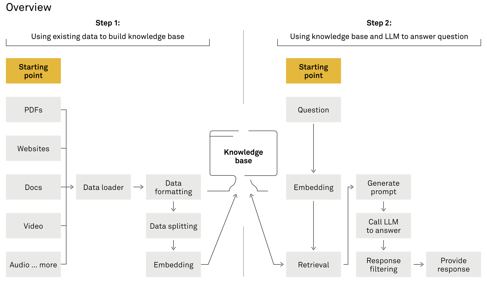
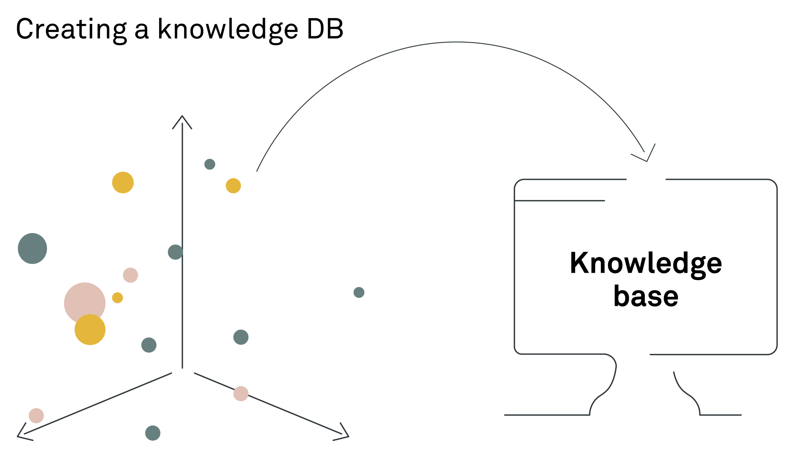
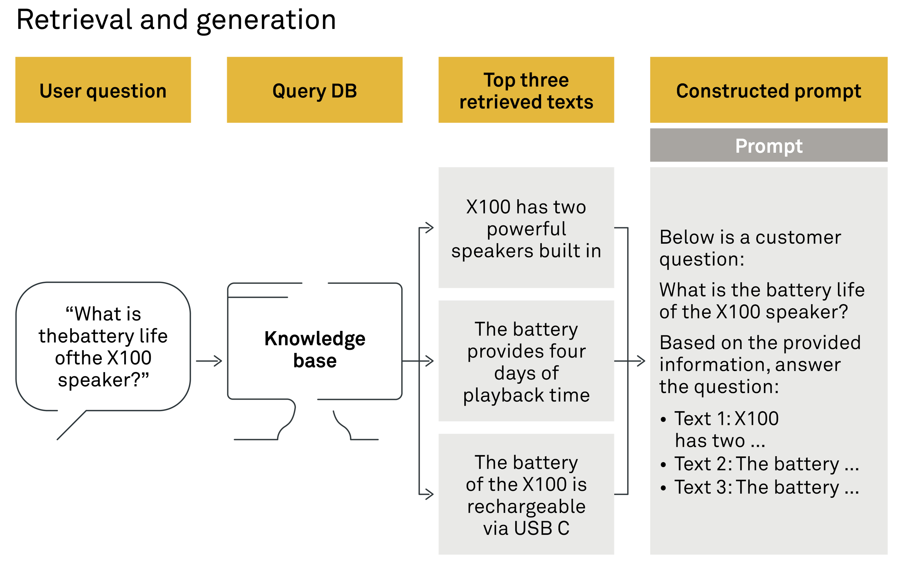

# \[推荐]Building high-quality RAG systems

> 感谢您关注我们对检索增强生成（RAG）系统的概述。我们希望这份指南能够揭示RAG的复杂工作原理，并展示其在不同环境下革新信息检索和响应生成的潜力。
>
> 我们已经建立了将RAG系统应用于生产环境的丰富经验。我们的专业知识涵盖了评估组织需求、部署定制化的、高性能的RAG解决方案。
>
> 如果您正在考虑将RAG系统融入公司运营中，并需要专业指导以确保成功，我们愿意提供帮助。我们将协助您在这个充满活力的技术领域中导航，以全新的方式利用检索增强生成（RAG）解锁您组织的集体知识潜力。
>
> 可以添加我的微信（备注RAG），咨询构建高质量申请加入我们的LLM+RAG高可用技术群！
>
> 

RAG stands for retrieval augmented generation and has become one of the hottest terms in search technology and generative AI in 2023 – likely to continue in 2024. And no wonder it has.\
RAG代表检索增强生成，它已成为2023年搜索技术和生成式AI中最热门的术语之一，并可能会持续到2024年。这并不奇怪。

\
RAG is transforming how organisations utilise their vast quantity of existing data to power intelligent chatbots and to automate complex workflows much faster than ever before. A successful RAG system can draw on an organisation’s collective knowledge to function as an always-available, in-house expert to deliver relevant answers, grounded in verified data. \
RAG正在改变组织利用其大量现有数据的方式，以更快的速度为智能聊天机器人提供动力并自动化复杂的工作流程。一个成功的RAG系统可以利用组织的集体知识作为一个始终可用的内部专家，提供基于经过验证的数据的相关答案。

\
We have developed RAG systems both for public and private clients, solutions deployed both for internal and external use and tools that are utilised in multiple languages. In this introduction, we will walk you through the primary steps required to set up a RAG system and especially highlight some of the intricacies when implementing generative AI for non-English languages such as Danish, German or Spanish. \
我们为公共和私人客户开发了RAG系统，这些解决方案既用于内部也用于外部，并且这些工具被用于多种语言。在这个介绍中，我们将引导您了解建立RAG系统所需的主要步骤，特别是在实施非英语语言（如丹麦语、德语或西班牙语）的生成式AI时的一些复杂性。

RAG structure, a brief overview\
RAG 结构简述 
-----------------------------------------------

Before we deep dive into the specific steps of setting up a RAG system, a simple way to view a RAG system is by dividing it into two core components:\
在我们深入了解建立RAG系统的具体步骤之前，一个简单的方法是将RAG系统分为两个核心组成部分：

1. **Indexing phase:** This initial stage involves processing the input data. The data is first loaded, appropriately formatted and then split. Later, it undergoes vectorisation through embedding techniques, culminating in its storage in a knowledge base for future retrieval.\
   索引阶段：这一初始阶段涉及到输入数据的处理。首先加载数据，对其进行适当格式化，然后进行切分。之后，数据通过嵌入技术进行向量化处理，并最终存储在知识库中以供将来检索。\

2. **Generative phase:** In this phase, a user’s query is input to the retrieval system. This system then extracts relevant information snippets from the knowledge base. Leveraging a large language model (LLM), the system interprets this data to formulate a coherent, natural language response, effectively addressing the user’s inquiry.\
   生成阶段：在这一阶段，用户的查询输入到检索系统中。该系统随后从知识库中提取相关的信息片段。利用一个大型语言模型（LLM），系统解读这些数据，以形成一条连贯的、自然语言的回应，有效地解答用户的查询。

<figure><figcaption></figcaption></figure>

Now, let us walk through the process step by step, from loading the data all the way to generating an answer.\
现在，让我们一步一步地走过从加载数据到生成答案的过程。

## **The indexing phase 索引阶段**

\
The initial indexing phase involves processing the input data, ensuring all relevant data is stored in the knowledge base. We then move on to the generative phase.\
初始的索引阶段包括处理输入数据，确保所有相关数据都存储在知识库中。之后，我们进入生成阶段。

### 1. Data loader: the devil is in the details 1. 数据加载器：细节决定成败

<figure><figcaption></figcaption></figure>

Your organisation already possesses a wealth of knowledge, and the goal of a RAG system is to tap into this knowledge. It could be anything from Word documents, PDFs and videos to website content. The first step of setting up a RAG system is, therefore, to make this information accessible to the RAG system by setting up “data loaders”. These are tools designed to collect and organise data from various sources, such as SharePoint, Dropbox or your company’s website, and prepare it for the RAG system to analyse and utilise.\
您的组织已经拥有了丰富的知识资源，RAG系统的目标就是挖掘这些知识。这些知识可以是从Word文档、PDF文件和视频到网站内容的任何形式。因此，建立RAG系统的第一步是通过设置“数据加载器”来使这些信息对RAG系统可访问。这些工具旨在从各种来源（如SharePoint、Dropbox或公司网站）收集和组织数据，并为RAG系统的分析和使用做好准备。

\
You need to set up data loaders for each type of file format your RAG system should handle. Default document loaders for various text formats are generally language agnostic. However, it is important that you keep the original format of documents, such as headers and paragraph layouts. This syntactic structure makes information retrieval more effective in the later stages of the system. Without syntactic structure and relevant metadata, locating specific information in a document can become much more difficult. This is particularly true for non-English languages that often do not have robust tools available for splitting text post-data loading in a semantically meaningful way. \
您需要为RAG系统应处理的每种文件格式设置数据加载器。对于各种文本格式，默认的文档加载器通常是语言无关的。**然而，保留文档的原始格式，如标题和段落布局是很重要的。这种句法结构使得在系统的后期阶段信息检索更加有效。**如果没有句法结构和相关元数据，定位文档中的特定信息可能会变得更加困难。对于那些常常没有强大工具可用于在数据加载后以语义有意义的方式分割文本的非英语语言来说，这一点尤其如此。

\
When it comes to multimedia content such as videos and audio recordings, there is a significant variability in performance on the ability to convert spoken language into text. We see that technologies such as Whisper v3 from OpenAI show promise in handling multiple languages but are performing less accurately in non-English languages. It is common practice to assess language-specific speech-to-text performance by reviewing standard benchmarks, but when it comes to audio, you will often need to do internal tests to ensure that the model works as intended in your specific use case.\
在处理视频和音频记录等多媒体内容时，将口语转换为文本的能力在性能上存在显著的变异性。我们看到，如OpenAI的Whisper v3等技术在处理多种语言方面展现出了潜力，但在非英语语言中的表现却不够准确。通过审查标准基准来评估特定语言的语音转文字性能是常见做法，但在处理音频时，通常需要进行内部测试以确保模型在特定用例中按预期工作

\
Starting with a standard data loader is generally a practical approach, but it is also important to closely inspect the processed data. This inspection can reveal what data, formatting or structural elements might have been lost in the process. When you understand these gaps, you can make targeted improvements and enhance the ability of the RAG system to search through and retrieve the right information from your organisation’s knowledge base.&#x20;

从标准数据加载器开始通常是一种实用的方法，但仔细检查处理后的数据也同样重要。这种检查可以揭示在处理过程中可能丢失的数据、格式或结构元素。当您了解这些差距时，可以进行针对性的改进，并增强RAG系统搜索和检索组织知识库中正确信息的能力。

\
In essence, _**setting up your RAG system begins with gathering all the pieces of knowledge scattered across your organisation into a unified, accessible format.**_ This process lays the foundation for leveraging AI to unlock new insights and efficiencies in your business.\
实质上，_**建立你的 RAG 系统始于将组织中分散的所有知识汇聚到一个统一、可访问的格式中。**_这个过程奠定了利用人工智能来解锁业务中新见解和效率的基础。

\
In this first step, you also need to be diligent with document access by following best practices in data management. You cannot bypass existing information restrictions in this first step, as bypassing restrictions here might lead users of the final generative product to generate responses that include information that they were not supposed to have access to. \
在这一步中，你还需要遵循数据管理的最佳实践，认真对待文档访问。在这一步中，你不能绕过现有的信息限制，因为在这里绕过限制可能会导致最终生成产品的用户生成包含他们本不应该访问的信息的响应。

\
An inconvenient yet necessary insight attained in this step is that we often see clients detecting broken data management processes in this part of the RAG project, leading to necessary but frustrating setbacks to preserve the information security of the company.\
在此步骤中获得的一个不便但必要的见解是，我们经常看到客户在此部分的 RAG 项目中检测到损坏的数据管理流程，从而导致必要但令人沮丧的挫折，以维护公司的信息安全。

### 2. Data formatting: the key to contextual responses 2. 数据格式化：实现上下文响应的关键 

<figure><figcaption></figcaption></figure>

In the first step, you loaded your organisation’s diverse knowledge through data loaders. The next step is data formatting, a process aiming at _**standardising the format of collected data**_. This ensures that the data is in the best shape for the subsequent phase, which involves breaking down the text into smaller, meaningful pieces.\
在第一步中，你通过数据加载器加载了组织的多样化知识。下一步是数据格式化，这个过程旨在标准化收集数据的格式。这确保了数据在后续阶段处于最佳状态，后续阶段涉及将文本分解为更小、有意义的部分。

\
Imagine taking the rich, complex information contained in various formats like HTML or PDF files and simplifying it into plain text. This simplification involves organising the text with basic markers to make the upcoming task of dividing the content more manageable. In sophisticated RAG systems, where multiple answers might fit a given context, it is valuable to organise additional details such as document titles, headers and topics alongside the text. This information, treated as metadata, aids in later stages for refining searches or analyses. For instance, when segmenting the text into chunks, knowing the topic of a particular chunk can significantly enhance the system’s ability to provide contextually relevant responses. \
想象一下，将包含在各种格式（如HTML或PDF文件）中的丰富而复杂的信息简化为纯文本。这种简化涉及使用基本标记来组织文本，以便更容易地进行后续的内容划分任务。在复杂的 RAG 系统中，一个给定的情境可能有多个答案适用，因此将文档标题、标头和主题与文本一起组织起来是有价值的。将这些信息视为元数据，在后续阶段帮助细化搜索或分析。例如，在将文本分割成块时，了解特定块的主题可以显著增强系统提供上下文相关响应的能力。

\
After the second step, you have all data in the same format and are now ready to begin text splitting. The third step is crucial for enabling semantic search in your RAG system, allowing it to efficiently analyse and make use of the information from your organisation.\
在第二步完成后，你现在拥有了相同格式的所有数据，并且准备好开始文本分割。第三步对于启用 RAG 系统中的语义搜索至关重要，这使得系统能够高效地分析和利用组织中的信息。

### 3: Text splitting: size matters 3：文本拆分：大小很重要  

In the process of developing a retrieval augmented generation (RAG) system, _**splitting text into appropriately sized chunks is a necessary third step to allow efficient search.**_\
在开发检索增强生成 (RAG) 系统的过程中，将文本拆分为适当大小的块是允许高效搜索的必要第三步。

\
The necessity of text splitting stems from the reliance on semantic search to find pertinent pieces of information. Semantic search operates through a vector search mechanism, which requires converting texts of limited length into embeddings. \
拆分文本的必要性源于依赖语义搜索来查找相关信息。语义搜索通过向量搜索机制运行，该机制需要将长度有限的文本转换为嵌入模型。

\
Embeddings are a way to translate the semantic meaning of text into a numerical format, represented as multidimensional vectors. For those looking to dive deeper into the concept of embeddings, [“Getting started with Natural Language Processing”](https://implementconsultinggroup.com/article/getting-started-with-natural-language-processing) offers a more detailed walkthrough.\
嵌入是一种将文本的语义含义转换为数字格式的方法，表示为多维向量。对于那些希望深入了解嵌入概念的人，“自然语言处理入门”提供了更详细的演练。嵌入是将文本的语义含义转换为数字格式的一种方法，表示为多维向量。对于那些希望深入了解嵌入概念的人，《自然语言处理入门》提供了更详细的指南。

\
Two primary factors influence the ideal text size that existing data needs to be split into: model constraints and retrieval effectiveness. \
影响将现有数据分割成的理想文本大小的两个主要因素：模型约束和检索效果。

#### **Model constraints** **模型约束**

\
Every embedding model has a maximum limit on how much text can be compressed into a single vector, known as the maximum token length. Exceeding this limit means the extra text will be ignored and lost from analysis. This is particularly limiting for multilingual models, which historically have more restrictive limits than their English-only counterparts. For example, a popular multilingual model such as MiniLM-L12-v2 only handles up to 128 tokens (roughly \~ 60 words), whereas the commercial Ada-02 embeddings from OpenAI currently support up to 8,191 tokens. \
每个嵌入模型都有一个最大限制，即可以压缩为单个向量的文本量，称为最大标记长度。超过此限制意味着额外的文本将被忽略并在分析中丢失。对于多语言模型而言，这一点尤其限制，因为它们的历史限制比仅英语模型更严格。例如，像 MiniLM-L12-v2 这样的流行多语言模型仅处理最多 128 个标记（大约 60 个单词），而来自 OpenAI 的商业 Ada-02 嵌入目前支持最多 8,191 个标记。

\
Additionally, a model’s performance can be affected by the length of text it was originally trained on, potentially reducing the model’s efficiency on retrieval for longer texts – despite being able to manage long inputs.\
此外，模型的性能可能会受到其最初训练文本长度的影响，这可能会降低模型在检索长文本时的效率，尽管它能够处理长输入。

#### **Retrieval effectiveness** **检索效果**

\
It might seem alluring to match text chunk length to the model’s maximum length for embedding. However, this approach does not typically yield the best retrieval outcomes.\
将文本块长度与模型的最大嵌入长度相匹配可能会显得很吸引人。然而，这种方法通常不会产生最佳的检索结果。

\
Larger text chunks can offer more context, aiding the semantic search in understanding the broader meaning. However, they can also make it more challenging to identify specific search terms. Smaller chunks, conversely, may improve the accuracy of matching specific queries but risk lacking the context needed for fully informed answers. Employing a hybrid strategy – using smaller chunks for detailed search and integrating additional context for context retrieval – can provide a more performant solution. It is vital that you understand the importance of chunk size no matter if your project involves multiple languages or is solely in English.\
较大的文本块可以提供更多上下文，有助于语义搜索理解更广泛的含义。然而，它们也可能使识别特定搜索词变得更具挑战性。相反，较小的文本块可能会提高匹配特定查询的准确性，但可能缺乏完全知情答案所需的上下文。采用混合策略——使用较小的块进行详细搜索，并集成额外的上下文进行上下文检索——可以提供更高效的解决方案。无论你的项目涉及多种语言还是仅使用英语，都要理解块大小的重要性。

\
Choosing the right size for text chunks in a retrieval augmented generation (RAG) system is not a one-size-fits-all solution. The ideal chunk size varies depending on your specific use case, including the file formats you are working with and the nature of your search tasks. There is no universal answer, but through experimentation and testing, you can determine the most effective chunking strategy for your needs.\
在检索增强生成（RAG）系统中选择合适的文本块大小并非一刀切的解决方案。理想的块大小取决于你的具体用例，包括你正在处理的文件格式和搜索任务的性质。没有通用的答案，但通过实验和测试，你可以确定最有效的分块策略以满足你的需求。

#### **Text splitting: techniques explained** **文本拆分：技术说明**

\
You can split text into manageable segments using different methods, each suited for specific needs and contexts. The methods generally fall into two main categories: rule-based and machine learning (ML)-based approaches. \
您可以使用不同的方法将文本分割成易于处理的段落，每种方法都适用于特定的需求和上下文。这些方法通常分为两大类：基于规则的方法和基于机器学习 (ML) 的方法。

\
**Rule-based splitting（基于规则的分隔）：**The rule-based method relies on analysing the characters in the text to find logical places to split, such as punctuation marks or specific string patterns. It is straightforward and does not require the text to be understood in its semantic context, making it a quick and resource-efficient option. It does, however, require that syntactic structure be preserved when loading the data.\
基于规则的方法依赖于分析文本中的字符，以找到逻辑上的分割位置，如标点符号或特定的字符串模式。这种方法简单直接，不需要理解文本的语义上下文，因此是一种快速且资源高效的选择。然而，它要求在加载数据时保持句法结构的完整性。

\
**Machine learning-based splitting（基于机器学习的分隔）：**ML-based methods leverage pre-trained transformer models, typically trained in English, to perform tasks such as sentence splitting or identifying semantic sections in the text. While some models support multiple languages, their accuracy outside English is currently not great, and they require significantly more computational resources than their rule-based par. \
基于机器学习的方法利用预训练的转换器模型，通常在英语中进行训练，执行诸如句子分割或识别文本中的语义部分等任务。虽然一些模型支持多种语言，但它们在英语以外的语言上的准确性目前并不理想，并且需要比基于规则的方法更多的计算资源。

\
Given the challenges with ML-based splitters for non-English languages, a simple rule-based approach is often recommended for starters. If the structure of the original data is maintained and formatted correctly, rule-based splitting can yield high-quality results.\
考虑到基于机器学习的分割器在非英语语言上的挑战，通常建议初学者采用简单的基于规则的方法。如果原始数据的结构得以保持并正确格式化，基于规则的分割可以产生高质量的结果。

\
Through the third step, you have segmented the text into semantically meaningful chunks using either rule-based or ML-based methods. Now, you are in a position to proceed with embedding these chunks for efficient storage and retrieval. The fourth step is foundational in preparing your data for a RAG system, ensuring that the system can access and analyse the information effectively.\
通过第三步，你已经使用基于规则或基于机器学习的方法将文本分割成语义上有意义的块。现在，你可以继续对这些块进行嵌入，以便进行高效的存储和检索。第四步是为 RAG 系统准备数据的基础，确保系统能够有效地访问和分析信息。

### 4. Embedding models: navigating the jungle 4. 嵌入模型：驾驭丛林

<figure><figcaption></figcaption></figure>

As a crucial fourth step in developing an efficient retrieval augmented generation (RAG) system, you must now select the appropriate embedding model. The choice can be more complex for languages other than English. The model you choose should be either multilingual to cover a wide range of languages or specifically designed for the particular language you are focusing on. It is worth noting that the most advanced models are typically optimised for English and may not perform as well with other languages.\
作为开发高效检索增强生成（RAG）系统的关键第四步，你现在必须选择适当的嵌入模型。对于非英语语言而言，选择可能更加复杂。你选择的模型应该是多语言的，以涵盖广泛的语言，或者专门为你关注的特定语言而设计。值得注意的是，最先进的模型通常针对英语进行了优化，可能在其他语言上表现不佳。

\
When you compare embedding models, you can use the massive text embedding benchmark (MTEB) as a helpful tool for comparison. MTEB evaluates models across more than 100 languages, providing a broad overview of their capabilities. Language-specific benchmarks can be valuable for tasks like classification, offering insights into the best models for languages from Danish to Spanish. However, keep in mind that these benchmarks might not fully reflect a model’s effectiveness in a RAG system, where the goal is different from tasks like classification.\
当你比较嵌入模型时，你可以使用大规模文本嵌入基准（MTEB）作为一个有用的比较工具。MTEB 在100多种语言中评估模型，提供了它们能力的广泛概述。针对特定语言的基准测试可能对分类等任务非常有价值，为从丹麦语到西班牙语的语言提供了最佳模型的见解。然而，请记住，这些基准测试可能无法完全反映模型在 RAG 系统中的有效性，因为该系统的目标与分类等任务不同。

\
A practical tip is to start with the highest-rated multilingual model in the MTEB retrieval benchmark, keeping in mind that its retrieval score is based on English. Therefore, it is necessary for you to conduct your own tests in your target language to accurately gauge performance.\
一个实用的建议是从 MTEB 检索基准中评分最高的多语言模型开始，但要记住，它的检索得分是基于英语的。因此，你需要在你的目标语言中进行自己的测试，以准确评估性能。

> **What is the MTEB benchmark?**\
> **MTEB 基准是什么？**
>
> The massive text embedding benchmark (MTEB) is the largest benchmark for text embeddings, combining 56 datasets to assess performance across tasks such as classification, clustering, retrieval and more. This open-source benchmark includes test datasets in over 112 languages, offering a comprehensive overview of text embedding performance across a diverse range of tasks and languages.\
> 大规模文本嵌入基准 (MTEB) 是文本嵌入方面最大的基准，它结合了 56 个数据集来评估分类、聚类、检索等任务的性能。此开源基准包括 112 种以上语言的测试数据集，提供了跨越各种任务和语言的文本嵌入性能的全面概述。
>
> * **Retrieval benchmark:** Retrieval, one of the eight types of tests in MTEB, evaluates the embeddings’ ability to retrieve relevant content in asymmetric search scenarios – specifically, matching short queries with longer texts. This benchmark is particularly crucial for building RAG systems.\
>   检索基准：检索是 MTEB 中八种测试类型之一，它评估嵌入在不对称搜索场景中检索相关内容的能力——具体来说，将短查询与较长的文本进行匹配。此基准对于构建 RAG 系统尤为关键。
> * **Lack of multilingual retrieval benchmark:** As of early 2024, MTEB’s retrieval benchmarks only include datasets in English, Polish and Chinese. For languages lacking specific retrieval benchmarks, such as Norwegian, German or Swedish, the choice may involve selecting a top-performing model from classification benchmarks or opting for a versatile multilingual model with strong retrieval capabilities in English.\
>   缺乏多语言检索基准：截至 2024 年初，MTEB 的检索基准仅包括英语、波兰语和中文数据集。对于缺乏特定检索基准的语言，如挪威语、德语或瑞典语，选择可能涉及从分类基准中选择表现最佳的模型，或选择在英语中具有强大检索能力的多功能多语言模型。

Embedding is a key process in organising your documents in a vector database, and it might require further customisation to meet your specific needs. Thankfully, with large language models (LLMs), it is now possible to generate training data from your existing content and fine-tune an embedding model to enhance performance significantly. This approach allows for a tailored solution that can improve retrieval accuracy by 5-10%, ensuring your RAG system efficiently connects queries to the correct information.\
嵌入是在向量数据库中组织文档的关键过程，可能需要进一步定制以满足你的特定需求。值得庆幸的是，借助大型语言模型（LLMs），现在可以从现有内容生成训练数据，并微调嵌入模型以显著提升性能。这种方法可以提供量身定制的解决方案，可以将检索准确性提高5-10%，确保你的RAG系统将查询高效地连接到正确的信息。

### 5. Creating the knowledge base: vector management 5. 创建知识库：向量管理

<figure><figcaption></figcaption></figure>

Creating the knowledge base for a RAG system typically involves indexing the data in a vector database (DB), where the embeddings created in the previous step are stored.\
为RAG系统创建知识库通常涉及将数据索引到一个向量数据库（DB）中，其中包含了前一步创建的嵌入。

\
Vector DBs are specifically designed to efficiently manage and retrieve vector embeddings based on semantic meaning rather than mere keyword matches. This capability is what empowers a RAG system to search through vast amounts of embeddings and retrieve the most pertinent pieces of information in response to user queries. It should be noted that although not as common, the information backbone could be another data structure and DB technology; it is not unusual to combine semantic vector search with a knowledge graph or existing relational databases for more complex organisations.\
向量数据库专门设计用于基于语义含义（而非仅仅是关键词匹配）高效管理和检索向量嵌入。此功能使 RAG 系统能够搜索大量嵌入，并根据用户查询检索最相关的部分信息。需要注意的是，尽管不常见，但信息骨干可能是另一种数据结构和数据库技术；将语义向量搜索与知识图谱或现有关系数据库相结合以实现更复杂的组织并不罕见。

\
An essential step is devising a strategy for the ongoing data management of the newly created knowledge base. This step is crucial for ensuring that the system’s information remains up to date and synchronised with the broader database infrastructure of your organisation.

一个基本步骤是为新创建的知识库制定持续的数据管理策略。此步骤对于确保系统信息保持最新状态并与组织的更广泛数据库基础设施同步至关重要。

\
Vector databases, such as Qdrant, Milvus and Chroma DB, are specialised storage solutions designed to handle these numerical representations. These platforms offer the advantage of being optimised for the quick retrieval of complex data patterns. In practice, though, the driving force when it comes to selecting the right vector DB comes from the need to integrate the storage with the organisation’s existing databases, which are often relational systems such as SQL databases. \
诸如 Qdrant、Milvus 和 Chroma DB 等向量数据库是专门为处理这些数字表示而设计的存储解决方案。这些平台具有针对复杂数据模式快速检索而优化的优势。然而，在实践中，选择合适的向量数据库的驱动力来自将存储与组织现有数据库（通常是 SQL 数据库等关系系统）集成的需求。&#x20;

\
When you create a process for the integration between the storage and the organisation’s existing databases, it involves setting up automated workflows or protocols that regularly update the RAG knowledge base with new data entries, modifications or deletions occurring in the company’s databases. This ensures that the knowledge base remains an accurate and up-to-date reflection of the organisation’s information landscape. _**By focusing on the synchronisation and management of data between the vector database and existing databases, companies can leverage their accumulated knowledge more effectively.**_ This alignment is not just about maintaining data integrity; it is about enhancing the accessibility and utility of information across the organisation. Again, as part of setting up these data flows, it is absolutely key that you preserve access restrictions to sensitive data in order not to leak information as part of generating answers to end users of the system that they were not intended to see. \
当您为存储和组织现有数据库之间的集成创建一个流程时，它涉及设置自动化的工作流或协议，定期使用公司数据库中发生的新数据条目、修改或删除来更新 RAG 知识库。这确保了知识库仍然是组织信息环境的准确且最新的反映。_**通过专注于矢量数据库和现有数据库之间的数据同步和管理，公司可以更有效地利用其积累的知识。**_这种对齐不仅仅是维护数据完整性；它还关乎增强整个组织的信息可访问性和实用性。同样，作为设置这些数据流的一部分，绝对关键的是您保留对敏感数据的访问限制，以便在向系统最终用户生成答案时不泄露他们无意看到的信息。

\
Having a strategic approach to data management underpins the success of the RAG system, ensuring it becomes a powerful tool in the organisation’s information ecosystem and that it stays relevant over time.\
采用数据管理战略方法是 RAG 系统成功的基础，确保其成为组织信息生态系统中的强大工具，并随着时间的推移保持相关性。

## **The generative phase 生成阶段** 

\
Once the indexing phase has ensured that all relevant data is stored in the knowledge base, we move on to the part of the system responsible for handling user inputs and generating answers to a given query. \
一旦索引阶段确保所有相关数据都存储在知识库中，我们就会转到负责处理用户输入并生成给定查询答案的系统部分。

### 6. Information retrieval: finding the right data 6. 信息检索：查找正确的数据 

\
In the generative phase of a retrieval augmented generation (RAG) system, the core function that determines the quality of the response is the retrieval of relevant information from a user’s query. This process typically begins with semantic search, which leverages the vector embeddings crafted during the indexing phase. \
在检索增强生成 (RAG) 系统的生成阶段，_**决定响应质量的核心功能是从用户的查询中检索相关信息**_。此过程通常从语义搜索开始，它利用在索引阶段制作的向量嵌入。

\
The user’s question (query) is transformed into a vector using the same embedding model that processed the knowledge base’s text, ensuring the query and the stored information share a common vector space. This alignment enables a semantic similarity search, aiming to find content that closely aligns with the user’s question in meaning, not just in shared keywords. \
使用与处理知识库文本相同的嵌入模型将用户的疑问（查询）转换为一个向量，确保查询和存储的信息共享一个公共向量空间。这种对齐实现了语义相似性搜索，旨在找到在含义上与用户的疑问紧密对齐的内容，而不仅仅是在共享关键词上。

\
In its simplest form, the retrieval step consists of a top-k vector retrieval that may return the 3-10 most similar matches to the search query. In an ideal scenario, the system would retrieve a single passage that precisely answers the query. Yet due to the often overlapping and contextually rich nature of information, it is required to sample multiple text chunks to provide fulfilling context for the large language model (LLM) to answer the question. \
在其最简单的形式中，检索步骤包括一个 top-k 向量检索，可能返回与搜索查询最相似的 3-10 个匹配项。在理想情况下，系统会检索到一个精确回答查询的段落。然而，由于信息通常具有重叠和丰富的语境性质，因此需要对多个文本块进行采样，以为大型语言模型（LLM）提供充分的上下文，以回答问题。

\
The precision of this retrieval process is critical. If the system retrieves passages that are irrelevant or wrong in the context related to the query, the generated response risks being false. Where RAG systems today typically come short is not by the inherent capability of the LLM to generate a meaningful response but in the database-and-retrieval design that occasionally provides contextually wrong data if not designed properly.&#x20;

这个检索过程的精度至关重要。如果系统检索到与查询相关的上下文中不相关或错误的段落，生成的响应就有可能是错误的。目前 RAG 系统通常存在的问题并不在于 LLM 生成有意义的响应的固有能力，而是在于数据库和检索设计，如果设计不当，有时会提供上下文错误的数据。

\
From our project experience, almost 9 out of 10 “wrong” or “low-quality” answers are caused not by the lacking abilities of the LLM itself but instead by the vector database not being able to return the right context for the LLM to generate its answer on top of. This also often points towards poor data management processes, e.g. by having duplicated documents describing the same standard operating procedure or other company information in different ways (where at least one is typically an outdated version of the document). \
根据我们的项目经验，几乎有 9 成的“错误”或“低质量”答案都不是由于 LLM 本身能力不足造成的，而是由于向量数据库无法为 LLM 提供正确的上下文，使其生成答案。这也经常指向了糟糕的数据管理流程，例如，有重复的文件描述了相同的标准操作规程或其他公司信息，以不同的方式描述（其中至少一个通常是文件的过期版本）。

\
It is often necessary to implement advanced retrieval strategies, such as reranking and filtering, to refine the search results. Reranking involves adjusting the initial search results based on additional criteria or algorithms to ensure that the most relevant passages are prioritised from a larger pool. Filtering further refines these results by removing any information that does not meet certain predefined standards or relevance thresholds, either with rule-based systems or a layer of LLM prompts.\
通常需要实施高级检索策略，例如重新排序和过滤，以优化搜索结果。重新排序涉及根据其他标准或算法调整初始搜索结果，以确保从更大的池中优先考虑最相关的段落。过滤通过删除不符合某些预定义标准或相关性阈值的任何信息，进一步优化这些结果，可以使用基于规则的系统或一层LLM提示。

\
However, there is only so much that can be done at the retrieval stage. If the knowledge base itself has simply been created by dumping all company data into the vector database without further consideration, the performance of the RAG system will likely never be satisfactory for a production deployment. Therefore, the construction of the knowledge base requires careful planning to organise the existing data in a way that enhances the system’s ability to discern and retrieve the precise information needed to answer user queries effectively.\
然而，在检索阶段能做的事情是有限的。如果知识库本身只是将所有公司数据转储到向量数据库中而没有进一步考虑，那么 RAG 系统的性能可能永远无法满足生产部署的要求。因此，知识库的构建需要仔细规划，以组织现有数据，从而增强系统识别和检索有效回答用户查询所需精确信息的能力。

### 7. Generating an answer 7. 生成答案 

\
You have now finally reached the point where you generate an answer using a large language model (LLM). This part of the process uses generative AI to turn the information you have retrieved into a clear and relevant response to the user’s question. \
你现在终于到达了使用大型语言模型（LLM）生成答案的阶段。此过程的这一部分使用生成式 AI 将你检索到的信息转化为对用户问题清晰且相关的回答。

\
It is a simple yet effective approach. \
这是一种简单而有效的方法。

\
After retrieving the text passages that closely match the user’s query, the system utilises an LLM to generate an answer. This is done by sending the LLM a text instruction, called a prompt, which includes the user’s question along with the selected text snippets, instructing the model to base its response on this specific context.\
在检索与用户查询紧密匹配的文本段落后，系统利用LLM生成答案。这是通过向LLM发送一条文本指令（称为提示）来完成的，其中包括用户的问题以及选定的文本片段，指示模型根据此特定上下文来回答。

\
An example of a simple prompt and generated answer might be:\
一个简单提示和生成答案的示例可能是：

<figure><figcaption></figcaption></figure>

**Large language models at a glance**\
**一览大型语言模型**

\
Briefly looking at the LLM, these models are sophisticated statistical models that predict subsequent words based on vast amounts of training data. The rapid advancement in LLM capabilities ensures that the state-of-the-art models are more than equipped to handle both customer-facing roles or internal applications in a RAG system, delivering high-quality outputs that meet the demands of real-world applications. \
简要了解 LLM，这些模型是复杂的统计模型，基于大量的训练数据预测后续单词。 LLM 能力的快速进步确保了最先进的模型不仅能够处理 RAG 系统中的面向客户的角色或内部应用程序，而且能够提供满足现实世界应用程序需求的高质量输出。

\
Following the process of the retrieval step, the process can be visualised as below:\
在检索步骤之后，该过程可视化为如下：

The reliability of responses generated by large language models (LLMs), such as those in a chat interface like ChatGPT, significantly underperforms when compared to a retrieval augmented generation (RAG) system that is grounded in contextual data. While simple chat interfaces can sometimes produce factually wrong answers, known as hallucinations, _**a RAG system significantly reduces the risk of factually wrong answers by anchoring responses in contextually relevant data snippets.**_ This grounding mechanism sets RAG systems apart, making them particularly suited for business environments where the credibility of information is paramount.\
大型语言模型（LLMs）生成的响应的可靠性，例如在 ChatGPT 等聊天界面中的响应，与基于上下文数据的检索增强生成 (RAG) 系统相比，表现明显逊色。虽然简单的聊天界面有时会产生事实错误的答案，即幻觉，但 RAG 系统通过将响应锚定在上下文相关的代码段中，显著降低了事实错误答案的风险。这种基础机制使 RAG 系统与众不同，使其特别适合信誉至上的商业环境。

\
**Hybrid RAG systems for exact answers**\
**用于精确答案的混合 RAG 系统**

\
It is important to note that in a RAG system, the exact wording of the generated response cannot be controlled and is determined by the LLM’s generative function, which can pose challenges in situations that require responses with absolute precision. To address this, integrating RAG systems with conventional NLU chatbot technologies, which utilise predefined responses for specific queries, can offer a comprehensive solution. This hybrid model combines the depth and adaptability of generative AI with the reliability of scripted responses, catering to the diverse needs of businesses seeking to maintain the highest levels of answer accuracy and trustworthiness, such as clients in industries such as finance, insurance and healthcare.\
值得注意的是，在 RAG 系统中，无法控制生成响应的确切措辞，而是由 LLM 的生成函数决定的，这在需要绝对精确响应的情况下会带来挑战。为了解决这个问题，将 RAG 系统与利用特定查询的预定义响应的传统 NLU 聊天机器人技术集成在一起，可以提供一个全面的解决方案。这种混合模型将生成式 AI 的深度和适应性与脚本化响应的可靠性相结合，满足寻求保持最高答案准确性和可信度的企业的多样化需求，例如金融、保险和医疗保健等行业的客户。

\
**Data privacy 数据隐私**

\
At Implement, we understand that data privacy remains a critical concern, especially regarding how company data might be used for model training. Addressing this, we design solutions that host the generative LLM models, such as GPT4, on secure servers in the EU. This IT infrastructure ensures that no data is utilised for model training purposes, granting businesses full control over their information, akin to other cloud storage services. For organisations that already utilise cloud storage, such as SharePoint, there is no hindrance to utilising generative AI and RAG using commercial models that support more than 100 languages fluently.\
在 Implement，我们理解数据隐私仍然是一个关键问题，尤其是在有关公司数据如何用于模型训练方面。针对此问题，我们设计了解决方案，将生成式 LLM 模型（例如 GPT4）托管在欧盟的安全服务器上。此 IT 基础设施确保不会将任何数据用于模型训练目的，从而使企业对其信息拥有完全控制权，类似于其他云存储服务。对于已经使用云存储（例如 SharePoint）的组织，使用生成式 AI 和 RAG 不会受到任何阻碍，因为这些组织可以使用流畅支持 100 多种语言的商业模型。

\
If, for security reasons, working with data in the cloud is not an option for your organisation, open-source models like Mistral MoE can be hosted on-premises, ensuring that data never leaves your closed network. State-of-the-art open-source models perform almost on par with models such as GPT4 in the context of RAG systems but only do so in English. \
如果出于安全原因，对您的组织而言，在云中处理数据不是一种选择，那么可以将 Mistral MoE 等开源模型托管在本地，从而确保数据绝不会离开您的封闭网络。最先进的开源模型在 RAG 系统的上下文中几乎可以与 GPT4 等模型相媲美，但仅限于英语。

\
As of early 2024, there is a significant gap in the performance of non-English languages between closed-source models, like GPT4, and open-source models. We expect that multilingual open-source models with performance sufficient for customer-facing on-premises RAG solutions will emerge during 2024.\
截至 2024 年初，GPT4 等闭源模型与开源模型之间的非英语语言性能存在显著差距。我们预计，在 2024 年期间，性能足以用于面向客户的本地 RAG 解决方案的多语言开源模型将出现。

### 8. Filtering and guardrails 8. 过滤和护栏 

\
Following the generation of an answer in a retrieval augmented generation (RAG) system, one last step remains before presenting the response to the user: filtering and applying guardrails. \
在检索增强生成 (RAG) 系统中生成答案后，在向用户呈现响应之前，还需要执行最后一步：过滤和应用护栏。

\
This final review process ensures that the generated answer not only meets the standards expected in a professional setting but also aligns with company guidelines and is free from any harmful content. The depth of filtering required can vary significantly based on the application’s context. In some cases, minimal filtering may suffice, especially in controlled environments and for tools designed for internal purposes. However, in more open-ended applications, extensive review mechanisms are essential to maintain the integrity and reliability of the responses provided. \
这一最终审查流程确保生成的答案不仅满足专业环境中的预期标准，而且符合公司准则，并且不包含任何有害内容。所需的过滤深度可能会根据应用程序的上下文而有很大差异。在某些情况下，最小的过滤可能就足够了，尤其是在受控环境中以及为内部目的设计的工具中。然而，在更开放的应用程序中，广泛的审查机制对于维护所提供响应的完整性和可靠性至关重要。

\
The review often involves additional calls to LLM models, designed to assess the appropriateness of the generated answer in the given context. These models can evaluate whether the response adheres to predefined content guidelines, ensuring it is free from bias, inaccuracies or any form of sensitive or inappropriate content that could harm the user or tarnish the company’s reputation. \
审查通常涉及对 LLM 模型的额外调用，旨在评估在给定上下文中生成答案的适当性。这些模型可以评估响应是否符合预定义的内容准则，确保其没有偏见、不准确或任何形式的敏感或不当内容，这些内容可能会损害用户或损害公司的声誉。

\
In addition, you can also apply content filtering at the initial stage of user query input. This preemptive measure helps to screen out any inappropriate, sensitive or harmful queries from the outset, further safeguarding the system from generating unsuitable responses. Examples of such filtering include identifying and blocking profanity, discriminatory language or requests for information that violates privacy regulations.\
此外，您还可以在用户查询输入的初始阶段应用内容过滤。这种先发制人的措施有助于从一开始就筛选出任何不当、敏感或有害的查询，进一步保护系统免于生成不合适的响应。此类过滤的示例包括识别和阻止亵渎、歧视性语言或违反隐私法规的信息请求。

<figure><figcaption></figcaption></figure>

Implementing these filtering and guardrail mechanisms is not just about preserving the factual accuracy of the answers. It is also about ensuring that every interaction reflects the organisation’s values, adheres to legal and ethical standards and contributes to a safe and respectful user experience.\
实施这些过滤和护栏机制不仅仅z为了保持答案的事实准确性。它还关乎确保每次互动都能反映组织的价值观、遵守法律和道德标准，并为用户营造安全和尊重的体验。

\
Through careful review and refinement of both the questions and the generated answers, businesses can leverage the transformative potential of RAG systems while maintaining the highest levels of trust and integrity in their digital communications.\
通过仔细审查和完善问题和生成的答案，企业可以在保持其数字通信中最高级别的信任和诚信的同时，利用 RAG 系统的变革潜力。

Thank you for following along with our overview of retrieval augmented generation (RAG) systems. We hope this guide has shed light on the intricate workings of RAGs and demonstrated their potential to revolutionise information retrieval and response generation in various settings. \
感谢您关注我们对检索增强生成 (RAG) 系统的概述。我们希望本指南阐明了zRAG 的复杂工作原理，并展示了它们在各种设置中革新信息检索和响应生成潜力的能力。

\
At  last, we pride ourselves on our extensive experience in bringing RAG systems to life in production environments. Our expertise spans assessing orga,nisational needs to deploying robust, high-performing RAG solutions tailored to your specific requirements.\
最后想说，我们为自己在生产环境中将 RAG 系统付诸实践的丰富经验而自豪。我们的专业知识涵盖评估组织需求，以部署针对您的特定要求量身定制的强大、高性能 RAG 解决方案。

\
If you are considering the integration of a RAG system in your company’s operations and need professional guidance to ensure success, we are here to assist, helping you navigate this exciting technology landscape and unlock the full potential of your organisation’s collective knowledge in new ways using retrieval augmented generation (RAG).\
如果您正在考虑在贵公司的运营中集成 RAG 系统，并且需要专业指导以确保成功，我们随时为您提供帮助（添加微信时请备注 RAG)，帮助您驾驭这一激动人心的技术领域，并使用检索增强生成 (RAG) 以新方式释放贵组织集体知识的全部潜力。

<figure><figcaption></figcaption></figure>

