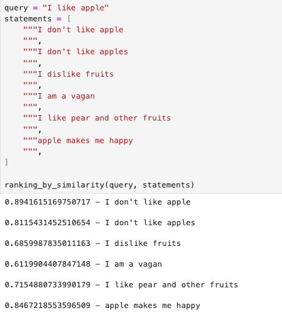

# 为什么RAG在生产环境中并不可靠

<mark style="color:green;">感谢您关注我们对检索增强生成（RAG）系统的概述。我们希望这份指南能够揭示RAG的复杂工作原理，并展示其在不同环境下革新信息检索和响应生成的潜力。</mark>

<mark style="color:green;">我们已经建立了将RAG系统应用于生产环境的丰富经验。我们的专业知识涵盖了评估组织需求、部署定制化的、高性能的RAG解决方案。</mark>

<mark style="color:green;">如果您正在考虑将RAG系统融入公司运营中，并需要专业指导以确保成功，我们愿意提供帮助。我们将协助您在这个充满活力的技术领域中导航，以全新的方式利用检索增强生成（RAG）解锁您组织的集体知识潜力。</mark>

<mark style="color:green;">可以添加我的微信（备注RAG），咨询构建高质量申请加入我们的LLM+RAG高可用技术群！</mark>

<figure><figcaption></figcaption></figure>

RAG隐藏了一定的复杂性，涉及以下幕后组件：

* 数据加载器：用于解析不同格式的外部数据，如PDF文件、网站、文档文件等。
* 数据分割器：将原始数据切分成更小的文本块。
* 嵌入模型：将文本块转换为向量。
* 向量数据库：存储向量并进行查询。
* 提示构建器：结合问题和检索到的文档。
* 大型语言模型（LLM）：生成答案。

> 本系列教程会把RAG过程整理成以下8个部分：
>
>
>
> 1. **数据加载**：关注数据的质量和来源的重要性，以及如何有效地加载大规模数据集以供后续处理。
> 2. **数据格式化**：将原始数据转换为适合模型处理的格式的方法，确保数据的一致性和可用性。
> 3. **文本拆分**：将长文本拆分为模型可处理的小段，同时保持信息的完整性和连贯性。
> 4. **嵌入模型的选择**：根据特定任务和语言选择最合适的嵌入模型的重要性，以及考虑模型的泛化能力和效率。
> 5. **创建知识库（向量管理）**：强调了高效管理和索引向量的重要性，以便快速检索相关信息。
> 6. **信息检索**：使用先进的检索技术来精确快速地从知识库中检索信息的方法。
> 7. **生成答案**：利用检索到的信息和LLM来创建准确、连贯的答案。
> 8. **过滤和护栏**：需设置合适的过滤机制来确保生成内容的准确性和适宜性的重要性。

如果你喜欢图表，这里有一个更复杂的图表供你参考。

它揭示了索引和检索过程，虽然略显复杂，但对整个过程的理解至关重要。

<figure><figcaption><p>RAG 索引和检索过程</p></figcaption></figure>

看上去很复杂，但其实使用开源框架是能很快制作一个RAG原型的。

像LangChain这样的框架抽象了构建RAG所涉及的大部分步骤，并且很容易对这些系统进行原型设计。

5行代码就能实现。

<figure><figcaption></figcaption></figure>

当然，这类代码片段表面上简单，后面隐含的问题是：根据您的具体用例，它们并不总能按一样的模式工作，而且需要非常仔细的调整。

它们作为快速入门RAG是很好的，但对于生产环境来说，肯定不是一个可靠的解决方案。\


## The Problems with RAG

If you start building RAG systems with little to no tuning, you may be surprised.\
如果您在几乎没有调整的情况下开始构建 RAG 系统，您可能会感到惊讶。

Here’s what I noticed during the first weeks of using LangChain and building RAGs.\
以下是我在使用 LangChain 和构建 RAG 的最初几周内注意到的。

### **1. The retrieved documents are not always relevant to the question.** **检索到的文档并不总是与问题相关。**

If you closely look at the chunks that the database retrieves, you will sometimes notice that they’re not exactly relevant to the problem. They’re certainly similar to the question to some extent but in many cases, they’re not fully aligned with what the user asks for. Moreover, these chunks can often be redundant and overlapping which makes the generated answer … repetitive.&#x20;

如果仔细查看数据库检索的块，有时会注意到它们与问题并不完全相关。它们在某种程度上肯定与问题相似，但在许多情况下，它们并不完全符合用户的要求。此外，这些块通常是冗余和重叠的，这使得生成的答案......重复。&#x20;

Here’s a small experiment that shows that the most similar documents to the query (in the embedding space) are neither the most relevant ones nor the most semantically similar (how surprising is that!)&#x20;

这里有一个小实验，它表明与查询最相似的文档（在嵌入空间中）既不是最相关的文档，也不是语义上最相似的文档！

In this example, the model disregarded the sentiment of the sentence and wasn’t even robust to plural (adding an “s” decreases the similarity by 8%)&#x20;

在这个例子中，模型忽略了句子的情感，并且对复数形式也不够鲁棒（添加一个“s”会使相似度降低8%）。

<figure><figcaption></figcaption></figure>

### **2. RAG systems lack basic world knowledge** **RAG系统缺乏基本的世界知识**

\
If you instruct a RAG to only rely on an external database to provide answers, it may surprise you by inventing facts or refusing to answer simple questions.

如果你指令一个RAG系统仅依赖外部数据库来提供答案，它可能会让你惊讶地编造事实或拒绝回答简单问题。\
\
I built a RAG once on tennis-related Reddit posts. While it successfully answered questions about the Wimbledon Open of that time, it was unable to answer general questions on tennis rules.

我曾经基于网球相关的Reddit帖子构建过一个RAG系统。虽然它成功地回答了当时的温布尔登公开赛的问题，但它却无法回答关于网球规则的一般性问题。\
\
I know you’re not supposed to ask questions beyond the scope of the data you feed the system, but if you deploy a RAG-based service, you should expect anything from the users.

我知道你不应该询问超出你提供给系统数据范围的问题，但如果你部署了一个基于RAG的服务，你应该预料到用户可能会提出任何问题。

### **3. Speed 速度**

\
Depending on the type of database you use and the size of the LLM, your RAG can be painfully slow. This can degrade the user experience. You should make your benchmarks first before building your solution.

根据你使用的数据库类型和LLM的大小，你的RAG可能会非常慢。这可能会降低用户体验。在构建解决方案之前，你应该先进行基准测试。

### **4. A lossy process** 一个有损的过程

\
Given how RAG splits the raw data into chunks, embeds those chunks, and retrieves the top K similar ones, the intrinsic information is gradually lost and distilled.\
Therefore, it becomes impossible to retain all the information from the external documents and provide a perfect answer to the question.\
This is important to keep in mind: we’re dealing with a lot of approximations here.

考虑到RAG如何将原始数据分割成块、嵌入这些块并检索最相似的前K个块，内在信息会逐渐丢失和提炼。 因此，保留外部文档中的所有信息并提供完美的答案变得不可能。 需要记住的重要一点是：我们在这里处理了很多近似值。

## Tips to improve the performance of your RAG

### **1. Inspect and clean your data**

**检查和清理数据**

The good old “garbage in, garbage out” principle still applies to RAG.\


“垃圾进，垃圾出”的原则对于RAG依然适用。\


If you feed documents that are noisy (Hello HTML tags!), not consistent with each other, confusing, or even redundant, the generated answer will suffer and reflect these defects.\
Be cautious when selecting the data your RAG will tap into.

如果你提供的文档噪声大（比如充满HTML标签！）、彼此之间不一致、令人困惑或甚至冗余，生成的答案也会受影响并反映这些缺陷。在选择RAG将要使用的数据时要格外小心。\
\
For example, instead of combining FAQs that are inherently short with long PDFs, you could create two vector stores instead.

例如，你可以创建两个向量存储，而不是将本质上很短的常见问题解答和长PDF文件合并在一起。

\
Here’s a quick sanity check to assess the data quality: do the exercise for a question or two. If you find it hard to get an answer with the support of the data you have at your disposal, don’t expect the RAG to perform better.

这里有一个快速的数据质量评估方法：对一两个问题做练习。如果你发现很难仅凭你手头的数据得到答案，不要期望RAG表现得更好。

### **2. Finetune the chunk size, the top\_k, and the chunk overlap**

**微调块大小、top\_k值和块重叠**

These parameters are **very** important since chunking is the core part of a RAG system. (Remember, the documents we retrieve from the store are **chunks**!)\
这些参数非常重要，因为分块是RAG系统的核心部分。（记住，我们从存储中检索的文档是数据块！）

These parameters impact the quality of the retrieved results and consequently, the generated answer.&#x20;

这些参数影响检索结果的质量，因此也影响生成的答案。

\
For example, a small chunk size might not catch enough context, while a big chunk size might introduce a lot of irrelevant noise.

例如，较小的块大小可能无法捕获足够的上下文，而较大的块大小可能会引入大量不相关的噪声。

\
There is no miraculous magic number I can give you here. The best solution is to run experiments and validate these hyperparameters on a test set. (Yes, building a test set is important!)

这里没有万能的最佳值。最佳解决方案是进行实验，并在测试集上验证这些超参数。（是的，构建一个测试集很重要！）

\
There’s also this [guide](https://www.pinecone.io/learn/chunking-strategies/) on chunking strategies from Pinecone that’s worth reading.

此外，Pinecone上有关于分块策略的指南值得一读。\


### **3. Leverage your document metadata**

**利用文档元数据**

It’s sometimes useful to filter over the available metadata (for example the date) after the documents are retrieved from the database. This provides another filtering dimension and doesn’t cost anything.\
有时，在从数据库检索文档后，根据可用的元数据（例如日期）进行过滤是有用的。这提供了另一个过滤维度，且不会产生任何成本。

### **Tweak your system prompt** 调整系统提示词

to give your RAG a default behavior or specific instructions. Here’s a system prompt I used in one of my projects:

给予你的RAG默认行为或特定指令。这是我在一个项目中使用的系统提示之一：

```
You're a helpful assistant that works for a big pharmaceutical company. 

You'll be asked questions about diseases and treatments among other things.

Stick to the question, provide a comprehensive answer and don't invent facts.
Use the following pieces of context to answer the question at the end.

If you don't know the answer, just say that you don't know, don't try to make up an answer.

%CONTEXT%
{context}

%Question%
 {question}

Answer:
```

## **Transform the input query** 转换输入查询

If you don’t express yourself clearly enough, the RAG might not find the relevant documents it needs to build a useful context. One way to solve that could be to **rephrase** the query by the LLM and try again.

如果你没有足够清晰地表达自己，RAG可能无法找到构建有用上下文所需的相关文档。一种解决方法可能是使用LLM重述查询，然后再试一次。

\
Another solution could be to try the [HyDE](https://boston.lti.cs.cmu.edu/luyug/HyDE/HyDE.pdf) method that takes the query, generates a hypothetical response, and uses both for retrieval in the embedding space.\
Query transformation is an exciting area that could improve RAG systems since LLMs tend to work better over smaller queries.

另一种解决方案可能是尝试HyDE方法，该方法接受查询，生成一个假设性响应，并将两者用于嵌入空间中的检索。查询转换是一个令人兴奋的领域，它可以改进RAG系统，因为LLM在处理较小的查询时往往表现得更好。
